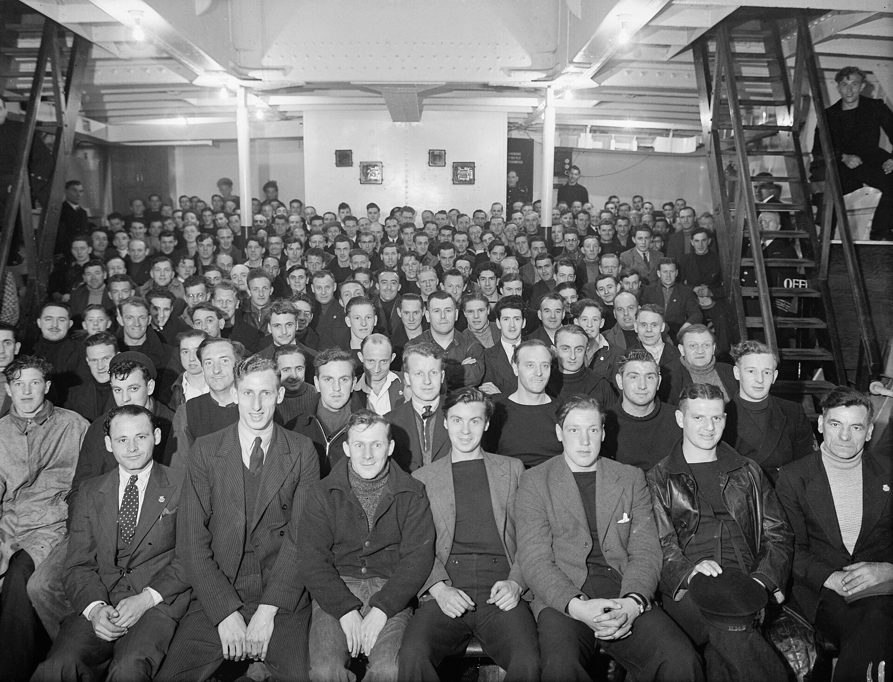

מדוע דווקא בעידן הדיגיטלי, כשמצלמה בטלפון מסוגלת לצלם ברזולוציית קולנוע, חוזרים כמה מהבמאים החשובים בעולם אל סליל הפילם הישן? התשובה הקצרה: **צילום על פילם** מספק תחושה חזותית — מרקם, עומק וגרעיניות — שרבים בתעשייה מרגישים שהתמונה הדיגיטלית מנסה לחקות אך לא באמת משחזרת. מה שנראה כמו נוסטלגיה טכנית הפך בשנים האחרונות לאחת המגמות המסקרנות בקולנוע העכשווי.

## מה בעצם קורה כאן?

במשך שני עשורים נדמה היה שסרט הצילום נכחד. המעבר לצילום דיגיטלי הוזיל הפקות, פישט עריכה והפך את העבודה לגמישה. אבל בשקט, קבוצה גדלה של יוצרים החלה להתעקש דווקא על החומר האנלוגי. **צילום על פילם** חזר להיות סמל של יוקרה אמנותית, לא של פיגור טכנולוגי.

כריסטופר נולאן (Christopher Nolan) הוא אולי הדגל הבולט של המגמה. סרטיו, ובראשם "אופנהיימר", צולמו בפורמטים אנלוגיים גדולים והוקרנו בגרסאות פילם באולמות נבחרים. קוונטין טרנטינו (Quentin Tarantino) לוחם שנים למען שימור ההקרנה על פילם, ובמאים כמו פול תומאס אנדרסון וגרטה גרוויג בחרו אף הם בסרט הצילום עבור חלק מיצירותיהם.

## למה פילם נראה אחרת?

ההבדל אינו רק רגשי. לפילם יש מאפיינים פיזיקליים ייחודיים:

- **גרעיניות אורגנית** — ה"רעש" הקולנועי שמעניק לתמונה חיות ותנועה עדינה, בניגוד לחלקות הדיגיטלית.
- **טווח דינמי רחב** — האופן שבו הפילם מטפל באזורי אור וצל, במיוחד בעור אנושי, נחשב בעיני רבים לטבעי יותר.
- **צבעוניות ייחודית** — שכבות האמולסיה מגיבות לצבע באופן שקשה לשחזר במלואו בפוסט-פרודקשן.
- **משמעת יצירתית** — כשכל מטר של סרט עולה כסף, השחקנים והצוות ניגשים לצילום בריכוז אחר.

הפורמט הדרמטי מכולם הוא ה-70 מ"מ, שמחזיר לחיים את חוויית ההקרנה הענקית של שנות השישים. סרטים כמו "האייטים השנואים" של טרנטינו הוקרנו בגרסאות מיוחדות שהפכו את הצפייה לאירוע בפני עצמו.

## מי מוביל את החזרה אל הפילם?

| יוצר | מאפיין בולט | תרומה למגמה |
|------|-------------|-------------|
| כריסטופר נולאן | צילום בפורמטים גדולים | הפיכת הקרנת הפילם לאירוע המוני |
| קוונטין טרנטינו | אחיזה עקרונית בפילם | שימור אולמות והקרנות אנלוגיות |
| פול תומאס אנדרסון | אסתטיקה קלאסית | חיזוק היוקרה של הסרט |
| גרטה גרוויג | שילוב פילם בהפקות רחבות | הנגשת המגמה לקהל צעיר |

## האם זו רק נוסטלגיה?

קל לפטור את התופעה כגחמה של במאים כוכבים, אבל יש כאן משהו עמוק יותר. דור הצופים הצעיר, שגדל כולו על מסכים דיגיטליים, מגלה דווקא משיכה אל החומרי והמוחשי — בדיוק כפי שקרה עם חזרת התקליטים והצילום האנלוגי. סרט הצילום הפך לחלק מאותה כמיהה תרבותית לדבר "אמיתי", בעל משקל וגוף.

גם התעשייה נערכת בהתאם. חברות שכמעט הפסיקו לייצר פילם חידשו את פסי הייצור, ובתי הקרנה משקיעים מחדש במקרנות אנלוגיות. ההקרנה על פילם הפכה מסמן של פינה שמורה לחובבים לאירוע תרבותי מבוקש.

## ומה בישראל?

גם כאן ניכר עניין גובר. הסינמטקים בתל אביב, בירושלים ובחיפה מקיימים מדי פעם הקרנות של עותקי פילם קלאסיים, ואירועי "רטרוספקטיבה" מושכים קהל שמחפש את החוויה המקורית. שאלת השימור — כיצד לשמר עותקים ישנים של הקולנוע הישראלי — הפכה בשנים האחרונות לנושא שמעסיק ארכיונאים, אוצרים וחובבי קולנוע.

החזרה אל הפילם אינה מכריזה מלחמה על הדיגיטל; רוב ההפקות ימשיכו להיות דיגיטליות מטעמי עלות ונוחות. אבל היא מזכירה לנו משהו יסודי: הקולנוע נולד כאמנות של אור שעובר דרך חומר. וכשהאור הזה חוזר לפגוש את הסרט, משהו במסך הגדול פשוט מרגיש חי יותר.
