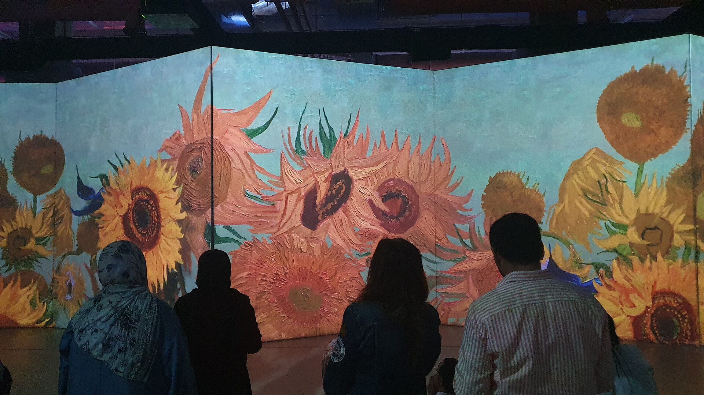

תערוכות חווייתיות הן אולי הדבר החם ביותר שקרה לעולם האמנות בעשור האחרון: במקום להביט בציור תלוי על קיר לבן, המבקר נכנס לחלל חשוך שבו היצירה מוקרנת ענקית על כל הקירות, הרצפה והתקרה, נעה, מתפרקת ומתחברת מחדש לצלילי פסקול עוטף. זו לא רק דרך חדשה להציג אמנות — זו הצעה אחרת לגמרי למה בכלל אומרת המילה "תערוכה".

התופעה, שכבר נדדה בין ערים גדולות בעולם, הגיעה גם לישראל בשנים האחרונות והפכה למגנט קהל. אבל ככל שהתורים מתארכים, מתחדד גם הוויכוח: האם מדובר בדמוקרטיזציה מרגשת של האמנות, או בבידור ראוותני שמחליף את המפגש האמיתי עם היצירה?

## מה הן בעצם תערוכות חווייתיות?

תערוכות חווייתיות, המכונות גם "אימרסיביות", מבוססות על עיקרון פשוט אך עוצמתי: להפוך את הצופה מצֵד חיצוני המתבונן ביצירה למי שנמצא בתוכה. באמצעות עשרות מקרנים בעוצמה גבוהה, מערכות סאונד היקפי ולעיתים גם ריח ותנועה, נוצר חלל שבו הציורים המפורסמים בהיסטוריה כאילו קמים לתחייה ומקיפים את המבקר מכל עבר.

המודל שהצית את הטרנד היה "התערוכה האימרסיבית" של וינסנט ואן גוך — פרויקט שנדד בגרסאות שונות בין ניו יורק, פריז ולונדון, והפך את "ליל הכוכבים" ואת חמניות המצוירות לזרם אינסופי של צבע נע. מאז צצו גרסאות דומות סביב מונה, קלימט, פרידה קאלו ואפילו סלבדור דאלי.

### מהיכן צמחה המהפכה?

את השורשים האמנותיים של התופעה אפשר לאתר עוד בעבודות מיצג ובאמנות אור מהמאה העשרים, אך הזינוק המסחרי הגיע עם התבגרות טכנולוגיית ההקרנה. הקולקטיב היפני "טימלאב" (teamLab) היה בין הראשונים שהפכו את החוויה הדיגיטלית ליצירת אמנות בפני עצמה — מוזיאונים דיגיטליים שלמים בטוקיו ובמקומות נוספים, שבהם הצופה הופך לחלק מהיצירה המשתנה בזמן אמת.

## למה הקהל מתאהב?

ההצלחה של הפורמט אינה מקרית. תערוכות חווייתיות עונות בדיוק על מה שרבים מחפשים בתרבות העכשווית — חוויה מלאה, מרגשת ומצטלמת. הנה כמה מהסיבות המרכזיות:

- **נגישות רגשית:** גם מי שמעולם לא נכנס למוזיאון קלאסי מרגיש בבית בחלל עוטף וקצבי.
- **ממד חברתי:** מדובר בבילוי מלא־חושים המתאים לזוגות, למשפחות ולקבוצות.
- **צילום ורשתות:** כל פינה היא רקע מושלם למדיה החברתית, מה שמזין את השיווק מעצמו.
- **מפגש עם יצירות מיתולוגיות:** רבים פוגשים בפעם הראשונה יצירות שהכירו רק מהעתקים.

בישראל הביקוש הזה תורגם למתחמי אירועים ולמוסדות תרבות שאירחו הפקות אימרסיביות, ובמקביל מוסדות כמו מוזיאון תל אביב לאמנות והסינמטקים המשיכו לבחון כיצד לשלב מדיה חדשה בתוך המרחב האמנותי המסורתי.

## מה טוענים המתנגדים?

לצד ההתלהבות, לא מעט מבקרי אמנות מרימים גבה. הטענה המרכזית: תערוכה חווייתית אינה באמת מפגש עם אמנות, אלא עם רפרודוקציה מוגדלת ומולחנת. "ליל הכוכבים" האמיתי הוא בד קטן יחסית התלוי במוזיאון לאמנות מודרנית בניו יורק, ועוצמתו טמונה דווקא בקנה המידה האנושי, במרקם משיחות המכחול ובנוכחות הפיזית של החומר — כל אלה נעלמים בהקרנה ענקית.

יש הרואים בתופעה סימפטום לתרבות שבה החוויה החושית המיידית גוברת על ההתבוננות המעמיקה. אחרים דווקא מזכירים שכל טכנולוגיה חדשה עוררה חשש דומה, ושהאימרסיביות עשויה לשמש שער כניסה שיוביל קהל חדש אל המוזיאונים ה"אמיתיים".

## השוואה: תערוכה חווייתית מול תערוכה קלאסית

| היבט | תערוכה חווייתית | תערוכה קלאסית |
|---|---|---|
| מוקד | חוויה רב־חושית עוטפת | היצירה המקורית עצמה |
| קהל יעד | רחב, כולל לא־חובבי אמנות | חובבי אמנות ומבקרים קבועים |
| משך שהייה | 30–60 דקות של הקרנה | חופשי, לפי קצב הצופה |
| יתרון בולט | נגישות והתרגשות מיידית | מפגש אותנטי עם החומר |
| חיסרון עיקרי | מרחק מהיצירה האמיתית | נתפסת לעיתים כמרוחקת |

## לאן זה הולך מכאן?

המגמה כנראה רק תתעצם. ככל שהטכנולוגיה מוזלת והבינה המלאכותית מאפשרת ליצור סביבות דינמיות, סביר שנראה יותר ויותר הפקות שמשלבות מיצב, מוזיקה חיה והשתתפות אקטיבית של הקהל. השאלה המעניינת אינה אם התערוכות החווייתיות יישארו, אלא כיצד מוסדות האמנות המסורתיים יגיבו — האם יאמצו את הכלים החדשים או ישמרו על טהרת ההתבוננות השקטה.

בסופו של דבר, ייתכן שאין כאן תחרות אלא שני עולמות משלימים: החוויה העוטפת שמציתה את הסקרנות, והמפגש הפרטי, השקט, עם הבד המקורי שאליו אולי נחזור בזכותה.
