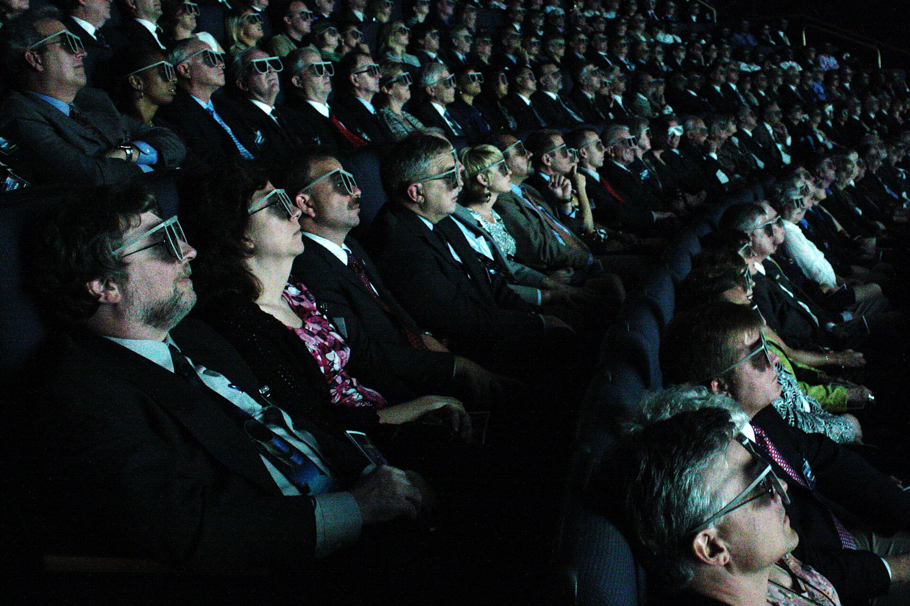

האם שמתם לב שהיציאה לקולנוע הפכה למחויבות של ערב שלם? התשובה הקצרה: כן. **סרטים ארוכים** חזרו להיות אופנה, ובמאי ההוליווד הבולטים ביותר מותחים את היצירות שלהם הרבה מעבר לשעתיים המסורתיות. מ"אופנהיימר" של כריסטופר נולאן (שלוש שעות עגולות) ועד "רוצחי הירח הפורח" של מרטין סקורסזה (מעל שלוש וחצי), נדמה שהאורך הפך לתו תקן של יוקרה קולנועית.

## למה סרטים ארוכים חזרו לאופנה?

המגמה של **סרטים ארוכים** אינה מקרית. בעידן שבו הסטרימינג מציע צפייה מקוטעת, עם עצירות, גלילות טלפון ופרקים שנבלעים ברקע, הקולנוע מחפש דרך להצהיר על ייחודו. סרט בן שלוש שעות באולם חשוך הוא חוויה שאי אפשר לשחזר על הספה — הוא דורש נוכחות, ריכוז והתמסרות. במובן הזה, האורך הפך לנשק במאבק על תשומת הלב שלנו.

יש כאן גם ממד של יוקרה. כשבמאי מקבל אישור להוציא סרט של שלוש שעות ולא לחתוך אותו, זו הצהרה על מעמד. סקורסזה, נולאן, קוונטין טרנטינו ואחרים נהנים מ"זכות סופית" (final cut) שמעטים זוכים לה, והם מנצלים אותה כדי לפרוש נרטיבים אפיים במלואם.

### הכלכלה שמאחורי האורך

באופן פרדוקסלי, סרט ארוך יכול לפגוע ברווחיות — פחות הקרנות ביום פירושן פחות כרטיסים. ובכל זאת, האולפנים נותנים לזה יד. הסיבה: סרטי פרסטיז' ארוכים הם מגנט לפרסים, לביקורות משבחות ולתדמית. "אופנהיימר" הוכיח שאפשר גם למשוך קהל עצום וגם לזכות בהערכה, וכך הפך את האורך ממכשלה ליתרון שיווקי.

## אילו סרטים הובילו את המגמה?

הנה כמה מהיצירות הבולטות שהזינו את שיחת "הסרט הארוך" בשנים האחרונות:

| סרט | במאי | משך משוער |
|------|--------|------------|
| אופנהיימר | כריסטופר נולאן | כ-3 שעות |
| רוצחי הירח הפורח | מרטין סקורסזה | כ-3.5 שעות |
| הברוטליסט | בריידי קורבט | מעל 3.5 שעות (עם הפסקה) |
| היה היה בהוליווד | קוונטין טרנטינו | כ-2.5 שעות |
| בבל | דמיאן שאזל | כ-3 שעות |

המעניין הוא ש"הברוטליסט" אף השיב לחיים מוסד שנעלם מהקולנוע המסחרי: **ההפסקה באמצע**. חלוקת הסרט לשני חלקים עם הפוגה מוסדרת מזכירה את סרטי הענק של שנות השישים, ומסמנת עד כמה המגמה רצינית.

## האם הצופה הישראלי אוהב את זה?

כאן התמונה מורכבת. מצד אחד, יש קהל שמתלונן על כאב גב וישבן קהה, ועל ההיערכות הלוגיסטית שדרושה כדי לפנות ערב שלם. מצד שני, דווקא בישראל — עם קהל סינפילי נאמן — הסרטים הארוכים מוצאים בית חם. הסינמטק בתל אביב, סינמטק ירושלים ורשתות כמו לב וסינמה סיטי מתאימים את לוחות ההקרנות, ולעיתים מוסיפים הפסקה יזומה או הקרנות בוקר.

החוויה הקהילתית משחקת כאן תפקיד. לצאת מ"אופנהיימר" אחרי שלוש שעות, לשבת בבית קפה ולנתח את מה שראית — זו בדיוק החוויה שהסטרימינג לא יכול לספק. הסרט הארוך הופך לאירוע חברתי, לא רק לצפייה.

## מתי האורך מוצדק ומתי מתיש?

לא כל סרט ארוך הוא יצירת מופת, וזו הסכנה. האורך מוצדק כשהוא משרת עולם עשיר, דמויות מרובדות ומקצב שנושם — כפי שקורה אצל סקורסזה, שיודע להפוך זמן לרקמה רגשית. הוא הופך למתיש כשהוא נובע מהיעדר עריכה נוקבת, מאגו של יוצר או מרצון להיראות "חשוב". הצופה החכם לומד להבחין בין אפוס לבין התפרעות.

בסופו של דבר, עידן הסרט הארוך אומר משהו על התרבות שלנו: בתוך עולם של תוכן מהיר ומקוטע, יש געגוע עמוק לחוויה איטית, שלמה וטוטאלית. אולי דווקא בכך טמון סוד הקסם — הקולנוע מזמין אותנו להאט, לשבת, ולתת ליצירה את הזמן שהיא דורשת.
