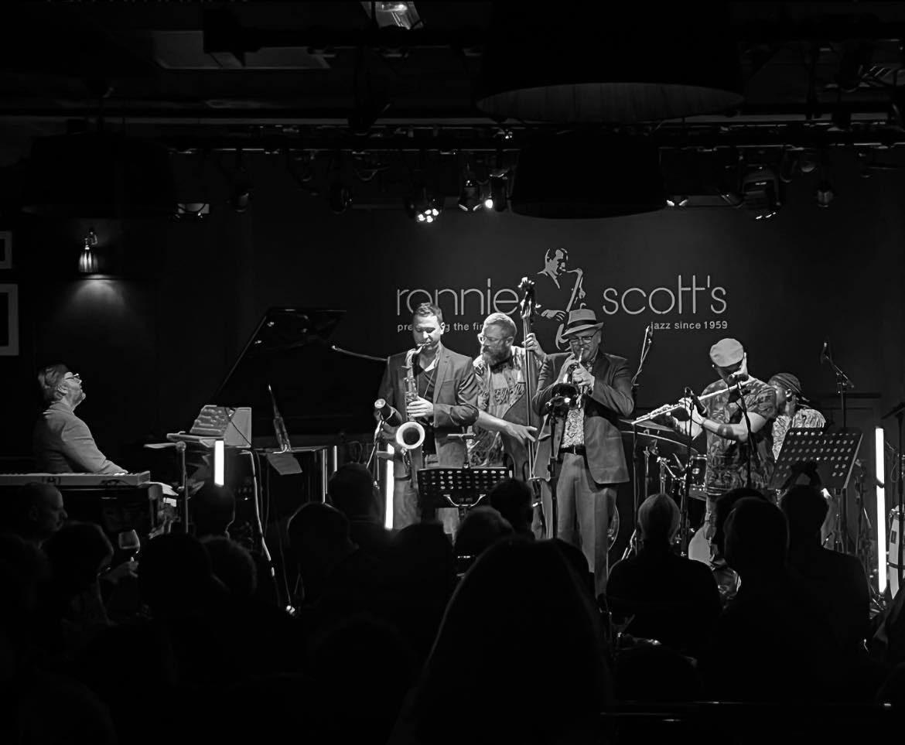

אם חשבתם שג'אז הוא מוזיקה של מועדונים מעושנים וקהל שיושב בדממה מנומסת — הגיע הזמן להכיר את **הג'אז החדש**. זרם צעיר שצמח בעשור האחרון בלונדון החזיר לז'אנר את הדופק, את הזיעה ואת רחבת הריקודים, וכבש קהל שגדל על היפ-הופ ואלקטרוניקה. זו אינה נוסטלגיה, אלא שפה חדשה לגמרי — והיא כבר מגיעה גם לבמות בישראל.

## מה זה בעצם ג'אז חדש?

הג'אז החדש (מכונה לעיתים "נו-ג'אז" או "סצנת הג'אז של לונדון") הוא לא סגנון מוגדר אחד אלא רוח דור. נגנים צעירים, רבים מהם בוגרי תוכניות חינוך מוזיקלי כמו "טומורואוז ווריורז" בלונדון, לקחו את שפת האלתור של הג'אז הקלאסי וערבבו אותה עם אפרוביט מערב-אפריקני, גרובים קריביים, גריים בריטי, סול ואלקטרוניקה. התוצאה היא מוזיקה שאפשר גם להתמסר אליה בהקשבה עמוקה וגם פשוט לרקוד לצליליה.

המהפכה הזו החזירה את הג'אז אל מקומו ההיסטורי — לא כמוזיקת מוזיאון, אלא כמוזיקה של תנועה, חגיגה וקהילה. במובן הזה, הדור החדש סוגר מעגל אל שורשי הז'אנר במועדוני ניו אורלינס.

## מי מובילים את המהפכה?

בלב הסצנה עומדת להקת **עזרא קולקטיב** (Ezra Collective), חמישייה לונדונית שהפכה לסמל: היא זכתה בפרס "מרקיורי" היוקרתי, מה שנחשב לרגע פורץ דרך שבו הג'אז החדש קיבל הכרה מהזרם המרכזי. הסקסופוניסטית **נובייה גרסייה** (Nubya Garcia) הפכה לאחת הדמויות המזוהות ביותר עם הצליל, לצד נגנים כמו **שבאקה האצ'ינגס** והבסיסט **תום סקינר**.

מעבר לאוקיינוס, בארה"ב, הסקסופוניסט **קמאסי וושינגטון** (Kamasi Washington) סימן מגמה מקבילה — ג'אז שאפתני ורוחני שדיבר גם אל קהל ההיפ-הופ, בין היתר דרך שיתופי פעולה עם עולם הראפ. יחד, הגלים הללו יצרו רגע נדיר שבו הג'אז שוב מרגיש כמו מוזיקה של ההווה.

| אמן / להקה | מוצא | הצליל בקצרה |
|---|---|---|
| עזרא קולקטיב | לונדון | אפרוביט, סול וגרוב סוחף |
| נובייה גרסייה | לונדון | סקסופון חלומי בין ג'אז לדאב |
| שבאקה האצ'ינגס | לונדון | רוחני, נשיפה ואנרגיה שבטית |
| קמאסי וושינגטון | לוס אנג'לס | ג'אז אפי, קולנועי ורחב יריעה |

## למה דווקא עכשיו?

כמה כוחות נפגשו יחד. ראשית, פלטפורמות ההזרמה חשפו מאזינים צעירים לג'אז מבלי המחסום של "מוזיקה גבוהה". שנית, דור שגדל על ביטים של היפ-הופ מצא בג'אז החדש את אותה תחושת גרוב, רק עם נגינה חיה ואלתור. ושלישית, סצנת מועדונים תוססת בלונדון — מקומות אינטימיים שבהם הקהל צעיר, מגוון ורוקד — יצרה תשתית חברתית לצמיחת התופעה.

התוצאה: ג'אז חדש הפך למילת מפתח בפסטיבלים גדולים, מגלסטונברי ועד פסטיבלי ג'אז אירופיים, ולעיתים ממלא אולמות שבעבר היו שמורים לכוכבי פופ.

## ומה קורה בישראל?

ישראל תמיד הייתה מעצמת ג'אז קטנה עם השפעה גדולה — די להזכיר את הבסיסט **אבישי כהן** ואת החצוצרן **אבישי כהן** (שם זהה, שני מוזיקאים שונים), שכבשו במות בינלאומיות. בוגרי מגמות המוזיקה ב"תלמה ילין" ובית הספר "רימון" ממשיכים להזין סצנה מקומית חיה.

מועדונים כמו **הגן היפני** בתל אביב, אירועי ג'אז בסינמטקים ובמתחמי תרבות, ופסטיבל הג'אז באילת — כולם מספקים במה למפגש בין המסורת לצליל החדש. אפשר לשמוע כאן הדים ברורים לרוח הלונדונית: נגנים צעירים שמשלבים ג'אז עם מוזיקה אתיופית-ישראלית, ים-תיכונית ואלקטרונית, ויוצרים גרסה מקומית ומסקרנת משלהם.

## איך מתחילים להקשיב?

- התחילו מאלבום של **עזרא קולקטיב** — הכניסה הכי נגישה ומזמינה.
- המשיכו לנובייה גרסייה כדי לטעום את הצד האטמוספרי והחלומי.
- הוסיפו את קמאסי וושינגטון למנה הגדולה, הקולנועית והשאפתנית.
- ואז חזרו הביתה, אל הג'אז הישראלי, ותגלו שהשיחה הזו מתנהלת גם כאן.

הג'אז החדש מוכיח שוב שהז'אנר הוותיק הזה יודע להתחדש בכל דור. הפעם הוא עשה זאת דרך רחבת הריקודים — ומזמין את כולנו לזוז.
