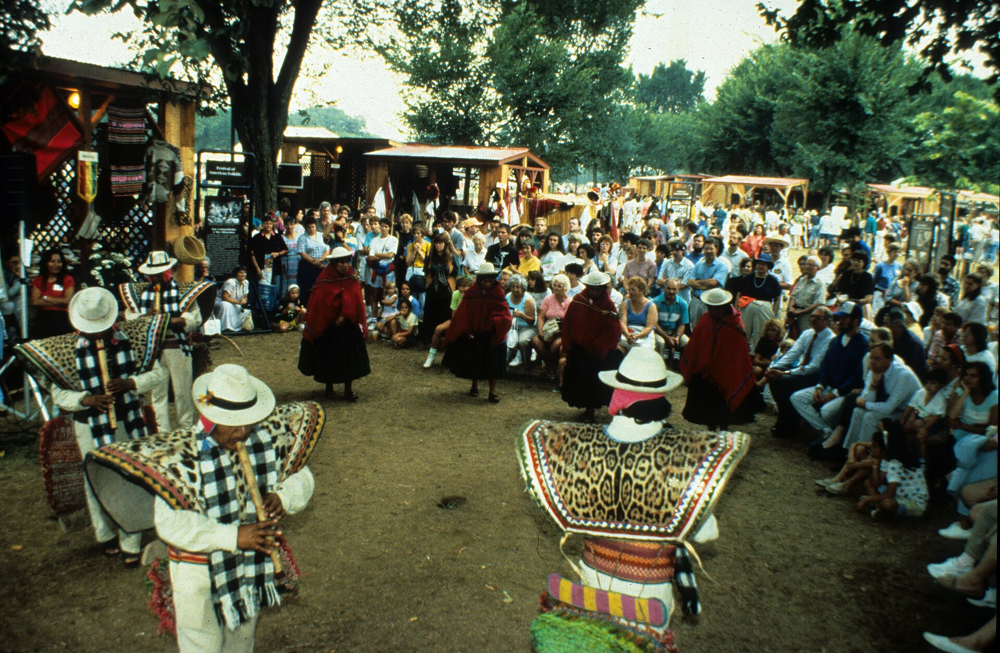

אם בשנים האחרונות מצאתם את עצמכם מתנועעים על רחבת ריקודים לצליל חם, מתנדנד ומדבק שאתם לא לגמרי מזהים — יש סיכוי טוב שנפלתם בקסמו של האפרוביטס. הז'אנר הניגרי הזה, שצמח בשכונות של לאגוס ואקרה, הפך בתוך עשור מסצנה מקומית לאחד הצלילים המשפיעים ביותר על המוזיקה הפופולרית בעולם, וגם ישראל כבר לא אדישה אליו.

אפרוביטס (Afrobeats, ברבים — ולא להתבלבל עם האפרוביט של פלה קוטי מהשבעים) הוא לא ז'אנר אחד מוגדר אלא מטרייה רחבה: תערובת של מקצבים מערב-אפריקאיים מסורתיים, היפ-הופ, ראגה, דאנסהול, ומעל הכל — תחושת אופטימיות חושנית שקשה לעמוד בפניה.

## מה זה בעצם אפרוביטס?

בבסיסו של האפרוביטס עומד גרוב. לא פסיכולוגיה מסובכת, לא מבנים הרמוניים מפותלים — אלא בס עגלגל, תופים מתקתקים ופולירית'מיקה שמזמינה את הגוף לזוז. השירה לרוב מלודית ומתגלגלת, מתובלת בסלנג ניגרי ("פידג'ין אינגליש"), והאווירה כמעט תמיד חמימה ומחבקת.

הצליל הזה הבשיל בתחילת שנות האלפיים, אך הפריצה הגדולה הגיעה בעשור האחרון, כשאמנים מלאגוס התחילו לחצות גבולות. מה שהתחיל כמוזיקה שמנוגנת בחתונות ובמסיבות רחוב הפך לפסקול של קיץ גלובלי.

## מי האמנים שהובילו את המהפכה?

אי אפשר לספר את סיפור האפרוביטס בלי כמה שמות מרכזיים. **ברנה בוי** (Burna Boy), שמכנה את הסגנון שלו "אפרו-פיוז'ן", הפך לאחד השגרירים הבולטים של הז'אנר, עם הופעות באולמות ענק ושיתופי פעולה בינלאומיים. **ויזקיד** (Wizkid) פרץ למודעות המערבית כשהשתתף בלהיט של דרייק, ומאז הפך לכוכב-על. **דוויד** (Davido) ו**רמה** (Rema) השלימו את החבורה, כשהאחרון אחראי לאחת מנקודות המפנה הגדולות של הז'אנר.

הסינגל "קלם דאון" (Calm Down) של רמה, בגרסה המשותפת עם סלינה גומז, הפך לתופעת רשת עולמית וסחף מיליוני האזנות — הוכחה חיה לכך שהצליל הניגרי כבר אינו נישה אלא זרם מרכזי.

## לוח האמנים המובילים

| אמן | מדינה | ידוע בזכות | סגנון |
|------|--------|-------------|--------|
| ברנה בוי | ניגריה | אלבומי אפרו-פיוז'ן והופעות ענק | אפרו-פיוז'ן |
| ויזקיד | ניגריה | שיתופי פעולה בינלאומיים | אפרוביטס קלאסי |
| רמה | ניגריה | הלהיט "קלם דאון" | אפרו-רייב |
| דוויד | ניגריה | להיטי רחבה מדבקים | אפרו-פופ |
| טמס | ניגריה | קול חם ובלדות מודרניות | אלט-אפרוביטס |

## למה דווקא עכשיו?

העלייה של האפרוביטס אינה מקרית. פלטפורמות ההזרמה שברו את הגבולות הגאוגרפיים של המוזיקה, והרשתות החברתיות — טיקטוק בראשן — הפכו קטעים בני חמש-עשרה שניות למכונות תפוצה עולמיות. שיר עם גרוב מדבק וכוריאוגרפיה קליטה יכול להתפוצץ תוך ימים, בלי קשר לשפה או למוצא.

לצד זה יש כאן גם סיפור תרבותי רחב יותר: הדור הצעיר בעולם מחפש צלילים אותנטיים, חמים ואופטימיים, כמענה נגדי לניכור ולקדרות. האפרוביטס מציע בדיוק את זה — מוזיקה שמזמינה לרקוד, לחייך ולהתחבר.

## ואיפה ישראל בכל זה?

גם כאן הצליל מחלחל. די-ג'ייז ברחבות תל אביב משלבים סטים של אפרוביטס, פלייליסטים ישראליים מתמלאים בשמות מלאגוס, ואפשר לזהות את ההשפעה גם בהפקות מקומיות שמאמצות את הגרוב הרך והמתנדנד. הפופ הים-תיכוני הישראלי, שתמיד ידע לספוג השפעות מכל העולם, מוצא באפרוביטס בן-ברית טבעי — שניהם חוגגים מלודיות, קצב ורגש.

ייתכן שבעתיד הקרוב נראה יותר ויותר שיתופי פעולה בין אמנים ישראלים לאמנים מהסצנה האפריקאית. בינתיים, מספיק להאזין פעם אחת כדי להבין למה כל העולם מתנועע לצליל הזה.

האפרוביטס אינו טרנד חולף. הוא מייצג שינוי עמוק במפת המוזיקה העולמית — כזה שבו אפריקה כבר אינה בשוליים אלא במרכז הבמה.
