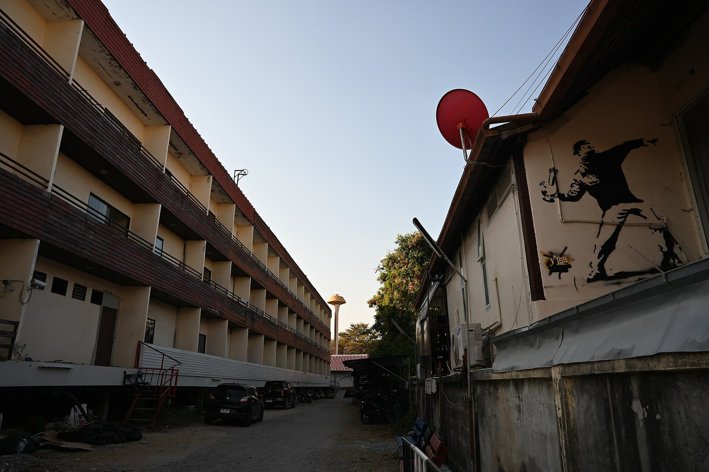

מה קורה כשאמנות שנולדה מתוך מרד, בחשכת הלילה ועם פחית ספריי ביד, מוצאת את עצמה תלויה על קיר מוזיאון בתאורה מוקפדת? זו בדיוק הדרמה של **אמנות רחוב** בעשור האחרון: ז'אנר שנרדף פעם כוונדליזם, וכיום נחשב לאחד הפרקים המסקרנים ביותר באמנות העכשווית. התשובה הקצרה — הגרפיטי לא ויתר על הרחוב, אבל למד לדבר גם בשפת הגלריה.

## מהמחתרת אל קדמת הבמה

במשך שנים נתפסה אמנות הרחוב כמעשה חבלה: כתובות ריסוס על קירות, חתימות ("טאגים") על קרונות רכבת, מרדף מתמיד עם העירייה. אבל משהו השתנה. אמנים אנונימיים החלו להפוך את הקיר העירוני לקנבס של ממש — עם דימויים חדים, מסרים פוליטיים והומור שנון.

הדמות שסימלה יותר מכל את המעבר הזה היא **בנקסי** (Banksy), האמן הבריטי המסתורי שזהותו נותרה חידה. יצירותיו, שמערבבות סטנסיל מדויק עם ביקורת חברתית עוקצנית, נמכרות היום במיליוני ליש"ט במכירות פומביות — פרדוקס מושלם עבור אמן שכל כולו מחאה נגד הממסד. לצדו פועל הצרפתי **JR**, שמדביק דיוקנאות ענק של אנשים אלמונים על בניינים ברחבי העולם והציג עבודות במוזיאונים היוקרתיים ביותר.

## למה דווקא עכשיו?

כמה כוחות פועלים כאן בו-זמנית. ראשית, האינסטגרם: קיר גרפיטי מרשים הוא תמונה מושלמת לרשת, וכל יצירה מוצלחת מקבלת חיים שניים כפוסט ויראלי. שנית, דור חדש של אוצרים שגדל על תרבות הרחוב ואינו רואה בגבול שבין "אמנות גבוהה" ל"נמוכה" קו קדוש. שלישית, הכמיהה לאותנטיות — בעולם רווי מסכים, יש משהו משכר בפגישה עם יצירה פיזית, גדולה, שנמצאת פשוט ברחוב שלך.

### פלורנטין: הבירה הישראלית של הגרפיטי

בישראל, אין ספק מי המלכה הבלתי מעורערת של הסצנה: שכונת **פלורנטין** בדרום תל אביב. הסמטאות המתקלפות שלה הפכו למוזיאון פתוח ומתחלף, שבו כל ביקור מגלה עבודה חדשה. אמנים מקומיים כמו **דדה** (Dede), **קלוני** ו**אינטי** הותירו כאן חותם, ולצדם מתרבים הסיורים המודרכים שהפכו את הגרפיטי לאטרקציה תיירותית ותרבותית כאחד.

גם מחוץ לפלורנטין ניכרת המגמה: קירות בשכונת שפירא, מיצגים בחיפה, ואפילו מוסדות ממוסדים כמו **מוזיאון תל אביב לאמנות** ו**מוזיאון ישראל** מקדישים תשומת לב הולכת וגוברת לאמנות עירונית ולתרבות הרחוב.

## הרחוב מול הגלריה: מתח שלא נעלם

לצד ההתלהבות, מרחפת שאלה מטרידה: האם אמנות רחוב שנתלית בגלריה ממוזגת עדיין אמנות רחוב? חלק מהפוריסטים טוענים שברגע שהיצירה מנותקת מההקשר העירוני, מהסיכון ומהחומריות של הקיר — היא מאבדת את נשמתה. אחרים רואים בכך הכרה מתבקשת ובמה לאמנים מוכשרים.

המתח הזה הוא בדיוק מה שהופך את המגמה למרתקת. בנקסי עצמו לועג לתופעה שוב ושוב — למשל כשגרסה שלו לתמונה שנמכרה בסותביס' "השמידה את עצמה" במגרסה מוסתרת מיד לאחר הרכישה.

## איפה לצפות באמנות רחוב בישראל?

| מקום | מה תמצאו שם | למי מתאים |
|------|-------------|-----------|
| פלורנטין, תל אביב | קירות מתחלפים, סיורים מודרכים | חובבי סצנה עדכנית |
| שכונת שפירא, תל אביב | עבודות פחות מתויירות, אותנטיות | מחפשי פינות נסתרות |
| חיפה התחתית | מיצגים ומיצבים עירוניים | אוהבי אמנות בהתהוות |
| מוזיאון תל אביב לאמנות | תערוכות אמנות עכשווית | קהל מוזיאונים קלאסי |

## איך מסתכלים על גרפיטי נכון?

כמה טיפים לצפייה מושכלת:

- **חפשו את המסר:** מעבר לצבע, לרוב מסתתרת אמירה פוליטית או חברתית.
- **שימו לב לטכניקה:** סטנסיל, ריסוס חופשי, פייסטינג (הדבקת נייר) — לכל אחת שפה משלה.
- **הקשר הוא הכל:** יצירה מקבלת משמעות מהמיקום שלה — קיר נטוש, חזית חנות, גשר.
- **תעדו, אל תשחיתו:** אמנות רחוב היא זמנית מטבעה; היום היא כאן, מחר תיצבע מחדש.

## שורה תחתונה

אמנות הרחוב מגלמת פרדוקס מרתק: ככל שהיא מתקרבת לממסד, כך מתחדד המתח שמעניק לה חיים. בין אם תפגשו אותה בסמטה בפלורנטין או בקיר מוזיאון — היא מזכירה לנו שאמנות לא חייבת לחכות לנו במוזיאון. לפעמים היא פשוט שם, ברחוב, ומחכה שנרים את המבט.
