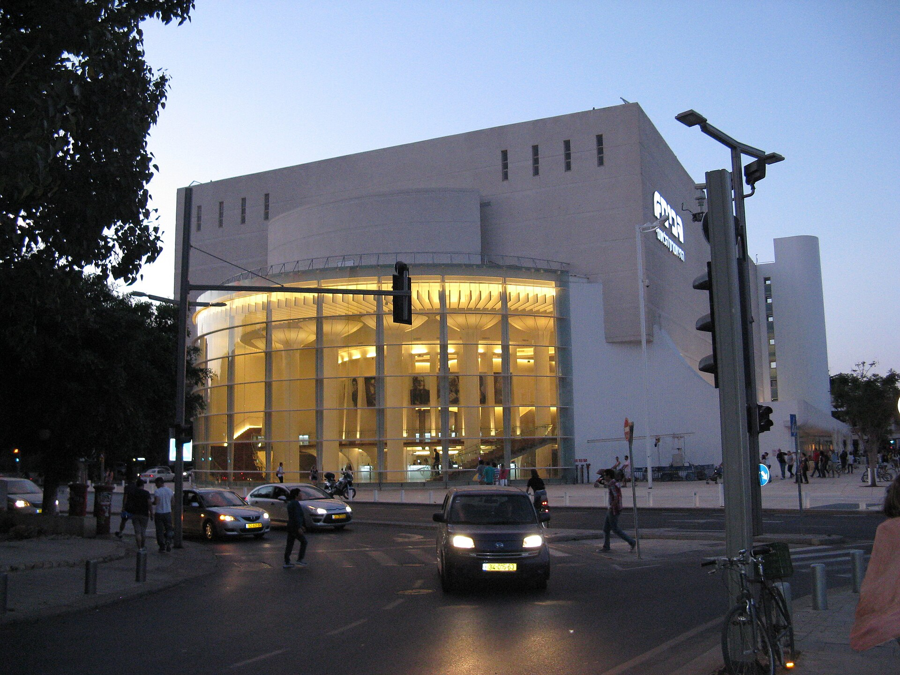

מה זה בעצם תיאטרון אימרסיבי? זו צורת תיאטרון שבה הקהל אינו יושב בחושך וצופה מרחוק, אלא נכנס פיזית לתוך עולם ההצגה — נע בין חדרים, עוקב אחרי דמויות, נוגע בחפצים ולעיתים אף משפיע על מהלך העלילה. במקום קיר רביעי שמפריד בין הבמה לאולם, **תיאטרון אימרסיבי מפרק את הגבול הזה לחלוטין** והופך את הצופה לחלק מהתמונה.

המונח "אימרסיבי" (מלשון טבילה, שקיעה) תפס תאוצה בעשור וחצי האחרונים, ורבים רואים בו את אחת התשובות המרתקות של התיאטרון החי לעידן המסכים. כשהכול זמין בלחיצה, החוויה שאי אפשר לשחזר במסך — להיות פיזית בתוך הסיפור — הפכה למטבע נדיר ויקר.

## איך נראית הצגה שבה אתה חלק מהעלילה?

תארו לעצמכם מבנה בן כמה קומות, כל חדר בו מעוצב בקפידה כזירת התרחשות. אתם מקבלים מסכה, נכנסים לבד או בקבוצה קטנה, ומכאן ואילך אתם בוחרים: ללכת בעקבות הדמות הראשית, להישאר בחדר ריק ולחטט במגירות, או לפצל את דרככם מחבריכם. אין שני צופים שחווים בדיוק את אותה הצגה.

ההפקה שהפכה את הז'אנר למותג עולמי היא **"שלא תישן עוד" (Sleep No More)** של קבוצת פאנצ'דראנק (Punchdrunk) הבריטית — עיבוד אילם ומהפנט למחזה "מקבת" של שייקספיר, שהתרחש במלון בדיוני בניו יורק והפך למחזה מופת של הז'אנר. לצידה פועלות קבוצות רבות בעולם שהפכו מחסנים, בתי חולים נטושים וארמונות ישנים לזירות תיאטרון חיות.

## למה דווקא עכשיו התיאטרון האימרסיבי פורח?

אפשר לזהות כמה כוחות שדוחפים את המגמה קדימה:

- **געגוע לחוויה גופנית:** אחרי שנים של צריכת תוכן דרך מסך, יש צמא לנוכחות פיזית, לריח, למגע ולסכנה הקטנה של הלא-נודע.
- **דור שגדל על משחקי מחשב:** הצופה הצעיר רגיל לעולמות פתוחים שבהם הוא בוחר את מסלולו, ותיאטרון אימרסיבי מדבר בדיוק בשפה הזו.
- **תרבות ה'רגע המשותף':** חוויה שאי אפשר לשכפל יוצרת סיפור אישי — בדיוק סוג הדבר שרוצים לחלוק.
- **מרחבים אורבניים מתפנים:** מבני תעשייה נטושים וחללים לא שגרתיים הפכו לזירות מפתות ליוצרים עצמאיים.

## תיאטרון אימרסיבי מול תיאטרון קלאסי: מה ההבדל?

| מאפיין | תיאטרון קלאסי | תיאטרון אימרסיבי |
|---|---|---|
| מיקום הקהל | יושב באולם, מול הבמה | נע בתוך המרחב, קרוב לשחקנים |
| תפקיד הצופה | צופה פסיבי | משתתף פעיל, לעיתים משפיע |
| מסלול הסיפור | ליניארי וקבוע | מפוצל, אישי, לא צפוי |
| חלל ההצגה | אולם עם במה | מבנה שלם, חדרים, אתר ספציפי |
| חווית הצפייה | זהה לכל הקהל | ייחודית לכל צופה |

ההבדל אינו רק טכני אלא תפיסתי: התיאטרון האימרסיבי מוותר על השליטה המוחלטת של הבמאי בעד הענקת חופש — ואחריות — לצופה.

## והבמה הישראלית? האם זה תופס כאן

גם בישראל ניכרת סקרנות גוברת כלפי הז'אנר. פסטיבלים כמו **פסטיבל עכו לתיאטרון אחר** היו מאז ומתמיד מגרש משחקים לתיאטרון מקום-ספציפי (site-specific) ולחוויות שחורגות מגבולות האולם המסורתי. סינמטקים, מוזיאונים כמו **מוזיאון תל אביב לאמנות** וחללי אמנות עצמאיים משמשים לא פעם זירה למופעים שמשלבים תנועה, מיצג וקהל פעיל.

גם מוסדות ותיקים כמו **תיאטרון הבימה** ותיאטרון הקאמרי מתנסים בפורמטים חווייתיים ובהצגות שמפרקות את המרחב המקובל. הקהל הישראלי, שידוע כחם, סקרן ולא מתבייש להתערב, הוא בעצם קרקע פורייה במיוחד לתיאטרון שדורש מעורבות.

## מה כדאי לדעת לפני שמגיעים?

למי שמעולם לא חווה הצגה כזו, כדאי לזכור כמה דברים:

1. **נעליים נוחות** — אתם תעמדו ותלכו הרבה.
2. **סקרנות פעילה** — ההצגה מתגמלת את מי שמעז לפתוח דלת ולהתקרב.
3. **ויתור על ציפייה לעלילה מסודרת** — לפעמים תפספסו סצנה, וזה בסדר; זה חלק מהיופי.
4. **נכונות להיות חלק** — לעיתים תתבקשו לבחור, לגעת, אפילו לענות.

## המילה האחרונה

תיאטרון אימרסיבי אינו טרנד חולף אלא תזכורת ליסוד הקדום ביותר של האמנות הבימתית: המפגש החי בין אדם לאדם. כשהצופה קם מכיסאו ונכנס אל תוך הסיפור, הוא מגלה מחדש שהתיאטרון מעולם לא היה רק מה שקורה על הבמה — אלא מה שקורה בינינו.
