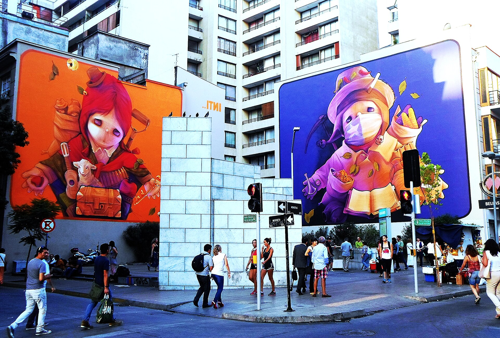

מי שפוסע היום בסמטאות פלורנטין בתל אביב מגלה מוזיאון בלי כרטיס כניסה ובלי שעות פתיחה: **אמנות הרחוב** הפכה בעשור האחרון מתופעה שולית ונרדפת לאחד הביטויים החיים והנגישים ביותר של האמנות הישראלית. הקירות המתקלפים, תריסי החנויות והמחסנים הישנים הפכו לקנבסים ענקיים, והשכונה כולה למעין גלריה פתוחה שמתחלפת כמעט מדי שבוע.

זו אינה עוד מגמה חולפת. אמנות הרחוב חדרה אל השיח התרבותי, אל סיורים מודרכים, אל קטלוגים של בתי מכירות ואפילו אל קירות של מוסדות ציבור — והפכה לשפה ויזואלית שמדברת אל קהל רחב הרבה יותר מזה שפוקד את הגלריות הממוסדות.

## למה דווקא פלורנטין הפכה לבירת הסטריט ארט?

התשובה טמונה בשילוב נדיר: שכונה תעשייתית מתפוררת, שכר דירה שהיה נמוך (בעבר), אוכלוסייה צעירה של אמנים ובעלי מלאכה, ושפע של קירות עירומים שמתחננים לצבע. פלורנטין הציעה למרססי הצבע בדיוק את מה שהם חיפשו — משטחים גדולים, אנונימיות יחסית ואווירה בוהמית סלחנית.

כך נולדה זירה שבה גרפיטי קלאסי, סטנסילים פוליטיים, פייסטינג (הדבקת פוסטרים) וציורי קיר מונומנטליים חיים זה לצד זה. ההליכה ברחובות וולובלסקי, קומונה של פריז או פרנקל היא חוויה משתנה: יצירה שראיתם אתמול עשויה להיעלם מחר תחת שכבת צבע חדשה.

## מי היוצרים שמאחורי הקירות?

הסצנה הישראלית פיתחה כוכבים משלה, שחלקם כבר חצו את הגבול אל עולם האמנות הממוסד:

- **דדה (Dede)** — ידוע בדמות הפלסטר (אגד רפואי) שהפכה לחתימה הוויזואלית שלו, סמל לפצע ולריפוי.
- **קלונימוס** — סטנסילים חדים עם מסר חברתי ופוליטי.
- **זירו (Zero Cents)** — דמויות צבעוניות ופרועות שהשתלטו על קירות שלמים.
- **פיל** ואחרים — קולקטיבים מתחלפים שהופכים את השכונה למעבדה חיה.

לצד השמות המוכרים פועלים עשרות אמנים אנונימיים, שמעדיפים להישאר מאחורי הקסדה או המסכה — כי חלק מהאתוס של אמנות הרחוב הוא בדיוק אי־הזיהוי הזה.

## אמנות הרחוב מעבר לתל אביב

התופעה מזמן אינה נחלת פלורנטין בלבד. בחיפה, שכונות כמו ואדי ניסנאס והדר הפכו למוקדי יצירה תוססים; בירושלים פועלים אמנים בשכונת נחלאות ובשוק מחנה יהודה, שם תריסי הדוכנים הפכו בלילה לגלריית דיוקנאות מרהיבה; ובבאר שבע פורחת סצנה צעירה שמנצלת את המרחב העירוני המתחדש.

| עיר | אזור מומלץ | מה תמצאו |
|------|-----------|-----------|
| תל אביב | פלורנטין | ציורי קיר, סטנסילים, פייסטינג |
| ירושלים | שוק מחנה יהודה | דיוקנאות על תריסים |
| חיפה | ואדי ניסנאס, הדר | יצירות רב־תרבותיות |
| באר שבע | העיר העתיקה | סצנה צעירה ומתחדשת |

## מוונדליזם ליוקרה: המתח שלא נעלם

אחד הפרדוקסים המרתקים של אמנות הרחוב הוא הדרך שעברה מפשע פלילי להשקעה מבוקשת. יצירות שנוצרו במקור כמחאה נגד המסחור נמכרות היום בבתי מכירות, וקירות שלמים הופכים לרקע מבוקש לצילומי אופנה ולפרסומות. יש בכך מתח מובנה: ברגע שהממסד מאמץ את הרחוב, האם הרחוב מאבד את קולו המרדני?

רבים מהיוצרים מודעים לפרדוקס הזה וממשיכים לעבוד בשני העולמות במקביל — בגלריה וגם על הקיר. חשוב לזכור שהיצירה ברחוב היא בת חלוף מעצם טבעה: היא נחשפת לגשם, לשמש, לצבע של האמן הבא. ארעיות זו היא לא באג אלא פיצ'ר — היא מה שהופך כל סיור לחד־פעמי.

## איך חווים את זה נכון?

הדרך הפשוטה ביותר היא פשוט ללכת לאיבוד בסמטאות פלורנטין בשעות אחר הצהריים, כשהאור רך והצבעים בוערים. מי שמעדיף הקשר יכול להצטרף לאחד מסיורי הסטריט ארט המודרכים שהפכו לאטרקציה תיירותית של ממש, שבהם מדריכים־אמנים מפענחים את הסמלים, הסיפורים והמלחמות הקטנות שמתנהלות על הקירות.

העצה החשובה ביותר: אל תתקבעו. היצירה שתראו היום עשויה כבר לא להיות שם בביקורכם הבא. וזה בדיוק היופי שבאמנות הרחוב — היא חיה, נושמת ומתחלפת יחד עם העיר.
