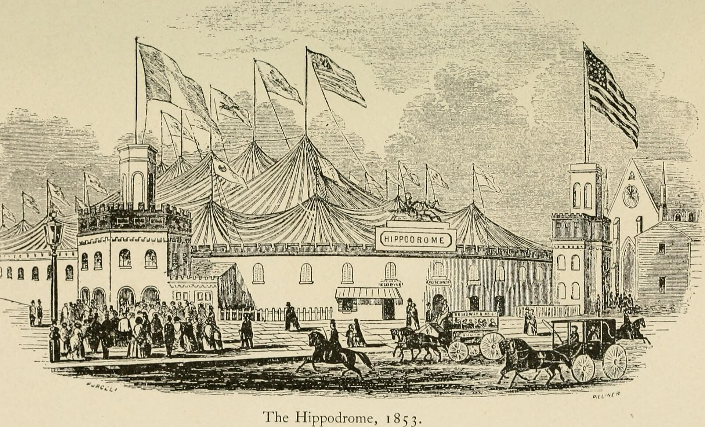

מה זה בעצם תיאטרון אימרסיבי? זו צורת תיאטרון שבה הקהל אינו יושב בשקט בחושך אלא נכנס אל תוך העולם הבדיוני, צועד בין החדרים, עוקב אחר הדמויות ולעיתים אף משתתף באירוע. במקום קיר רביעי שקוף שמפריד בין השחקן לצופה, **התיאטרון האימרסיבי מפוצץ את הקיר הזה לרסיסים** ומזמין אתכם פנימה. זו אחת המגמות המסקרנות והמדוברות ביותר בתיאטרון העכשווי, והיא מחלחלת בהדרגה גם אל הבמות הישראליות.

## איך נולד הז'אנר שמפרק את הקיר הרביעי?

הרעיון של הכנסת הקהל אל תוך היצירה אינו חדש — שורשיו נטועים בתיאטרון הניסיוני של המאה העשרים, בהפנינגים ובמופעי הרחוב. אך המהפכה האמיתית הגיעה בעשורים האחרונים, כאשר להקות כמו **פאנצ'דראנק** (Punchdrunk) הבריטית הפכו את המושג לתופעה בינלאומית. ההפקה האגדית שלהם 'שיסע לי' (Sleep No More), עיבוד חופשי ל'מקבת' של שייקספיר שהתקיים במלון בדיוני בן חמש קומות בניו יורק, הפכה לסמל של הז'אנר: הצופים, עוטי מסכות לבנות, שוטטו בחופשיות בין החדרים המעוצבים בקפידה ובנו לעצמם עלילה אישית.

מאז צמחו עשרות הפקות ברוח דומה ברחבי העולם, מלונדון ועד שנחאי, וכל אחת מהן דחפה את הגבולות של מה שמותר לקרוא לו "הצגה".

## למה תיאטרון אימרסיבי כובש דווקא עכשיו?

לא במקרה הז'אנר פורח בעידן שבו כולנו שקועים במסכים. ככל שהחיים הופכים וירטואליים יותר, גובר הצמא לחוויה פיזית, בלתי אמצעית, שאי אפשר לשכפל בסטרימינג. תיאטרון אימרסיבי מציע בדיוק את זה: ריח, מגע, קרבה נשימתית לשחקן, ותחושה של הרפתקה חד-פעמית.

יש בכך גם היגיון דורי. הקהל הצעיר, שגדל על משחקי מחשב ועל חדרי בריחה, מחפש חוויה **אינטראקטיבית** שבה יש לו סוכנות והשפעה. הישיבה הפסיבית באולם מרגישה לרבים כמו שריד מהעבר. התיאטרון האימרסיבי עונה על הצורך הזה ומעניק לצופה תחושה שהוא בורא את הערב שלו במו רגליו.

### מה ההבדל בינו לבין תיאטרון רגיל?

| מאפיין | תיאטרון קלאסי | תיאטרון אימרסיבי |
|---|---|---|
| מיקום הקהל | יושב באולם מול הבמה | נע בתוך החלל בין השחקנים |
| הקיר הרביעי | קיים ושומר על ריחוק | מפורק לחלוטין |
| נקודת המבט | אחידה לכל הצופים | אישית ומשתנה מצופה לצופה |
| החלל | אולם תיאטרון מסורתי | מבנה נטוש, מלון, מחסן או דירה |
| משך החוויה | ליניארי וקבוע | לעיתים חופשי, לפי בחירת הצופה |

## איך זה מרגיש להיות בפנים?

החוויה מתחילה עוד לפני שהמסך עולה — כי אין מסך. לרוב תתבקשו למסור את הטלפון, ללבוש מסכה או פריט לבוש מסוים, ולשמור על שתיקה. משם אתם חופשיים לבחור: להצמד לדמות אחת לאורך כל הערב, לחקור חדר ריק, או לרדוף אחרי קול שנשמע מהמסדרון. **אף שני צופים אינם חווים את אותה ההצגה**, וזה בדיוק הקסם.

עבור חלק זו חוויה משחררת ומרגשת; עבור אחרים היא עלולה להיות מטרידה או מבלבלת, שכן היא דורשת עירנות מתמדת וויתור על הפסיביות הנוחה. אך גם חוסר הנוחות הזה הוא חלק מהעניין: הז'אנר מבקש להעיר את הצופה ולהזכיר לו שהוא נוכח, כאן ועכשיו.

## והתיאטרון האימרסיבי בישראל?

גם על הבמות המקומיות ניכרת השפעת המגמה. פסטיבלים ניסיוניים כמו **פסטיבל עכו לתיאטרון אחר** מארחים כבר שנים הפקות ספציפיות-לאתר (site-specific) שמתקיימות במבצר, בסמטאות ובחללים לא שגרתיים, ומטשטשות את הגבול בין צופה למשתתף. גם הסצנה העצמאית בתל אביב ובירושלים מייצרת מיזמים חוויתיים בדירות, במחסנים ובבתי קפה, לעיתים במסגרת שיתופי פעולה של יוצרים צעירים המחפשים אלטרנטיבה לבמה הממוסדת.

מוסדות גדולים כמו **תיאטרון הבימה** והתיאטרון הלאומי נעים בזהירות רבה יותר, אך הרוח כבר כאן. סביר להניח שבשנים הקרובות נראה יותר ויותר הפקות שמזמינות את הקהל לקום מהכיסא ולצעוד אל תוך הסיפור.

## שווה לנסות?

בהחלט — בתנאי שאתם באים בראש פתוח. תיאטרון אימרסיבי אינו מתאים למי שמחפש ערב רגוע של צפייה פסיבית, אבל הוא מתגמל בנדיבות את מי שמוכן להתמסר. זו הזמנה לחוות תיאטרון לא כמשהו שמתבוננים בו מרחוק, אלא כמשהו שחיים בתוכו. ובעולם רווי מסכים, הפיתוי הזה קשה לעמוד בפניו.
