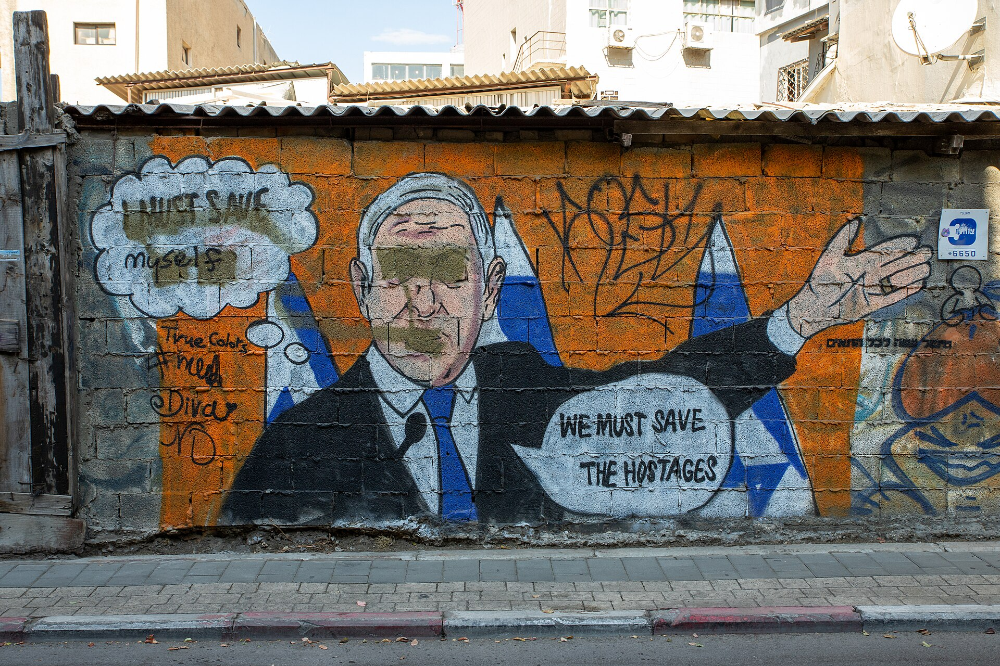

מי שמטייל בסמטאות פלורנטין בשעת בין ערביים לא יכול להתעלם מכך: **אמנות רחוב** הפכה בעשור האחרון מתופעת שוליים חתרנית לאחד מפניה התרבותיים הבולטים של תל אביב. קירות שלמים הפכו ליריעות ציור, תריסים חלודים למסך, ומה שנחשב פעם לוונדליזם שמופיע בחשכה הפך לאטרקציה שמושכת סיורים מודרכים, צלמי אינסטגרם ואפילו הזמנות עבודה ממותגים מסחריים.

התשובה הקצרה לשאלה למה זה קורה דווקא עכשיו: העיר צמאה לחזות אנושית וספונטנית בתוך נוף של בטון ופיתוח נדל"ני, והאמנים מצאו ברחוב גלריה בגודל אינסופי, נטולת שומרי סף.

## מאיפה הגיעה אמנות הרחוב הישראלית?

השורשים נטועים בתרבות הגרפיטי העולמית של שנות ה-80 וה-90, שהגיעה לישראל דרך תרבות ההיפ-הופ, הסקייטבורד והפאנק. בתחילת הדרך זו הייתה פעילות אנונימית ולא חוקית: טאגים מהירים, סטנסילים חתרניים וכתובות פוליטיות. הרחוב היה מרחב מחאה, לא תערוכה.

המעבר התרחש בהדרגה. יוצרים ישראלים כמו קוקוצ'ה (Klone), דדה (Dede), זכי"ם (Zerocents) ואחרים החלו לפתח שפה ויזואלית מובחנת שחרגה מעבר לחתימה בלבד. הדימויים נעשו מורכבים יותר, צבעוניים יותר, ולעיתים קרובות טעונים במסר חברתי — פליטות, צבאיות, זהות ישראלית מפוצלת.

### למה דווקא פלורנטין?

השילוב של מבנים ישנים, בעלי בתים סלחניים, שכירויות נמוכות יחסית ואוכלוסייה צעירה ויצירתית הפך את פלורנטין למעבדה עירונית מושלמת. הרחובות הצרים יצרו "מסדרונות" של קירות, וכל ביקור חוזר חושף שכבה חדשה — כי ברחוב, שלא כמו במוזיאון, היצירה בת חלוף. גשם, טיח מתקלף ואמן מתחרה שמצייר מעליך הם חלק מכללי המשחק.

## בין מחאה לאסתטיקה: מה מניע את היוצרים?

הסצנה הישראלית מתאפיינת במתח מתמיד בין שני קטבים. מצד אחד עומדת אמנות רחוב עם אג'נדה מובהקת — דימויים שעוסקים במשבר הדיור, בזכויות מהגרי עבודה בדרום העיר, במתחים פוליטיים או בטראומה קולקטיבית. מצד שני צומח זרם דקורטיבי-אסתטי, שמדגיש צבעוניות, דמויות מסקרנות ופורטרטים ענקיים שנועדו קודם כול לרגש ולייפות.

שני הזרמים אינם סותרים בהכרח. אחד היתרונות הגדולים של המדיום הוא הנגישות: אין צורך בכרטיס כניסה, בלבוש הולם או בידע מוקדם. היצירה פוגשת את הצופה בדרכו לעבודה, ובכך היא ממשיכה את החזון הישן של הבאת האמנות אל העם.

## מוקדי אמנות רחוב בישראל: לאן הולכים?

פלורנטין אמנם מובילה, אך התופעה מזמן חצתה את גבולות תל אביב. הנה מפת דרכים תמציתית:

| מוקד | מה מייחד אותו | מתאים ל |
| --- | --- | --- |
| פלורנטין, תל אביב | ריכוז הגבוה בארץ, מגוון סגנונות | סיור מקיף ראשון |
| חיפה התחתית | שילוב של נוף תעשייתי ונמל | חובבי אווירה אורבנית גולמית |
| שוק מחנה יהודה, ירושלים | ציורי תריסים שמתגלים בלילה | חוויה של יום-לילה מתחלף |
| נחלת בנימין וסביבתה | מפגש בין מסחר לאמנות | משפחות ומטיילים מזדמנים |
| באר שבע, העיר העתיקה | סצנה צעירה ומתפתחת | מי שמחפש את הגל הבא |

## המיסוד: ברכה או קללה?

השאלה הגדולה שמרחפת מעל הסצנה היא מה קורה כשהחתרני הופך למיינסטרים. כיום עיריות מזמינות מוראלים "רשמיים", חברות נדל"ן משתמשות באמנות רחוב כדי למתג שכונות שעוברות ג'נטריפיקציה, ורשתות מסחריות מגייסות אמני גרפיטי לקמפיינים.

מצד אחד, המהלך מעניק ליוצרים פרנסה, הכרה ובמה. מוסדות כמו מוזיאון תל אביב לאמנות והגלריות הפרטיות פתחו דלת לאמנים שהגיעו מהרחוב. מצד שני, מבקרים טוענים שהמסחור מרוקן את הז'אנר מהסכנה, מהאלתור ומהמסר שהגדירו אותו. כשהמוראל מוזמן ומאושר מראש, האם הוא עדיין אמנות רחוב — או פרסומת מוקפדת?

## איך נהנים מזה נכון?

- **צאו ברגל, לא ברכב.** אמנות הרחוב חיה בפרטים הקטנים — פינת סמטה, מדרגה, פתח ניקוז.
- **חזרו שוב.** אותו קיר ייראה אחרת בעוד חודשיים. הזמניות היא חלק מהיופי.
- **הצטרפו לסיור מודרך.** מדריכים מקומיים מספקים הקשר על היוצרים והמאבקים מאחורי הדימויים.
- **צלמו בכבוד.** תעדו, אבל זכרו שמדובר ביצירה של אמן שעמל עליה — לא רק ברקע לתמונת פרופיל.

בסופו של דבר, אמנות הרחוב היא מראה מהירה ומדויקת של רוח הזמן העירונית. היא נולדת בלילה, מתקלפת ביום, ומספרת את סיפורה של עיר שמסרבת להישאר אפורה. בין אם היא חתרנית ובין אם ממוסדת — היא הפכה לחלק בלתי נפרד מהדי-אן-איי הוויזואלי של ישראל.
