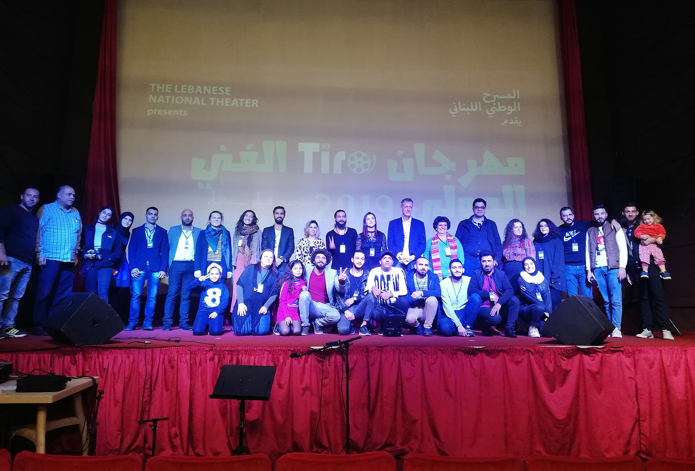

מה קורה כשכל צופה קולנוע הופך למבקר, ארכיונאי ואספן בו-זמנית? התשובה נקראת **לטרבוקסד** — אפליקציה חברתית שבה משתמשים מתעדים כל סרט שהם צופים בו, מעניקים לו דירוג כוכבים וכותבים ביקורת שיכולה להיות שורה אחת עוקצנית או מסה קטנה. בשנים האחרונות לטרבוקסד הפכה מכלי נישה של חובבי קולנוע לתופעה תרבותית של ממש, וגם בישראל היא צוברת קהל נאמן שמשנה את הדרך שבה אנחנו חושבים על סרטים.

## מה זה בכלל לטרבוקסד?

בבסיסה, לטרבוקסד היא הכלאה בין רשת חברתית לבין יומן אישי של צפייה. כל משתמש בונה לעצמו פרופיל, מסמן סרטים שראה, נותן להם דירוג של חצי עד חמישה כוכבים, ומוסיף ביקורת אם בא לו. אפשר לעקוב אחרי חברים, לראות מה הם צפו בסוף השבוע, וליצור רשימות אישיות — מ"הסרטים שגרמו לי לבכות" ועד "קולנוע איטלקי משנות השבעים".

היופי בלטרבוקסד הוא בשילוב בין הרצינות למשחקיות. מצד אחד, זו פלטפורמה שמעודדת תיעוד קפדני והיסטוריה אישית של צפייה; מצד שני, היא מלאה בהומור, בממים ובתרבות אינטרנט שהפכה את הביקורת הקצרה לאמנות בפני עצמה.

## איך לטרבוקסד שינתה את חוויית הצפייה

לפני עידן האפליקציה, הצפייה בסרט הייתה לרוב אירוע חד-פעמי שנעלם ברגע שיצאנו מהאולם. לטרבוקסד הפכה את הרגע הזה לחוויה מתמשכת: הסרט לא נגמר בכותרות הסיום, אלא ממשיך בדירוג, בביקורת ובשיחה עם אחרים.

זה יצר תופעה מעניינת — הצפייה הפכה **חברתית ותיעודית** גם כשאנחנו לבד על הספה. אנשים מתחילים לחשוב על הסרט תוך כדי צפייה, לנסח בראש את המשפט השנון שיכתבו אחר כך. יש בכך משהו שמעמיק את הקשב, אך גם משהו שמכניס לחדר עין ביקורתית מתמדת.

האפליקציה גם החזירה לחיים סרטים ישנים ונשכחים. כשמישהו מדרג יצירה של אינגמר ברגמן או של אנייס ורדה ומצרף לה ביקורת סוחפת, הסרט הזה פתאום צף מחדש בפיד של אלפי משתמשים. כך נוצרת דינמיקה שבה קלאסיקות ארט וסרטי מחתרת מקבלים חיים שניים.

## תרבות הביקורת הקצרה

אחד הדברים הכי מזוהים עם לטרבוקסד הוא סגנון הביקורת הייחודי שהתפתח בה. במקום מסות ארוכות, המשתמשים הצטיינו בשורות קצרות, חדות ולעיתים קורעות מצחוק. ביקורת של מילה אחת, בדיחה פנימית, או השוואה בלתי צפויה בין סרט אמנותי לסדרת ריאליטי.

הסגנון הזה יצר שפה חדשה של דיבור על קולנוע — פחות אקדמית, יותר נגישה, אך לא בהכרח שטחית. דווקא בתוך ההומור מסתתרות לעיתים תובנות חדות על סרטים, במאים וז'אנרים. זו דמוקרטיזציה של הביקורת: לא צריך תואר בקולנוע כדי להשמיע דעה, וגם לא במה ממוסדת.

## למה זה תופס דווקא עכשיו בישראל

הקהל הישראלי, שתמיד אהב סינמטקים ופסטיבלים כמו פסטיבל הקולנוע ירושלים ופסטיבל חיפה, מצא בלטרבוקסד בית טבעי. האפליקציה מאפשרת להמשיך את שיחת הקולנוע גם אחרי שהאורות נדלקים, ומחברת בין חובבים שמחפשים המלצות מעבר לרשימות הרשמיות של שירותי הסטרימינג.

| שימוש בלטרבוקסד | מה זה נותן |
|---|---|
| דירוג כוכבים | תיעוד מהיר של הרושם מהסרט |
| ביקורת כתובה | ביטוי אישי ושיחה עם קהילה |
| רשימות מותאמות | סדר, גילוי סרטים חדשים ונשכחים |
| מעקב אחרי חברים | המלצות אישיות ואמינות |
| סטטיסטיקות שנתיות | סיכום הרגלי הצפייה שלך |

## הצד השני של המטבע

לא הכל ורוד. יש הטוענים שהדירוג המספרי משטח את חוויית הצפייה — שכל סרט הופך למספר כוכבים במקום לחוויה מורכבת. אחרים מדברים על "לחץ צפייה", התחושה שצריך לראות כמה שיותר סרטים כדי לצבור סטטיסטיקות מרשימות, כמעט כמו משחק. ולעיתים, הרדיפה אחרי הביקורת השנונה גוברת על ההתבוננות האמיתית ביצירה.

ובכל זאת, קשה להתעלם מהברכה שבכלי כזה. בעידן שבו הסטרימינג מציף אותנו באלגוריתמים אנונימיים, לטרבוקסד מחזירה את המימד האנושי לגילוי קולנוע: המלצה של חבר, טעם של אדם אמיתי, שיחה חיה על מה שראינו.

## אז שווה להצטרף?

אם אתם אוהבים קולנוע ורוצים לתעד, לגלות ולדבר על סרטים — התשובה כמעט בוודאות כן. לטרבוקסד לא רק שומרת רשימה של מה שראיתם, אלא הופכת את אהבת הקולנוע לחוויה שיתופית, מתמשכת ומהנה. וזו אולי המהפכה האמיתית: היא מזכירה לנו שסרט טוב הוא רק ההתחלה של שיחה.
