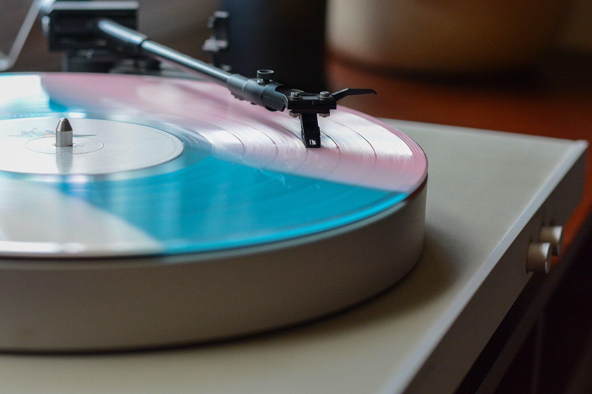

## מה זה בארי האזנה ולמה כולם מדברים עליהם?

בארי האזנה (Listening Bars) הם המקום שבו חיי הלילה מחליטים, לרגע, פשוט להקשיב. במקום קיר של בַּאסים שמרעיד את החזה ומקצב שנועד להזיז אלפי גופות, מדובר במרחב אינטימי שבו המוזיקה — לרוב מתקליטי ויניל שמתנגנים על פטיפון איכותי — היא הכוכבת הראשית, ולא רק פסקול הרקע לשיחה. התשובה הקצרה: בארי האזנה הם מקומות בילוי מוקפדים שבהם הסאונד האנלוגי, האקוסטיקה והבחירה המוזיקלית עומדים במרכז, והם הופכים במהירות לאחת המגמות המסקרנות בחיי הלילה בישראל ובעולם.

הרעיון אולי נשמע חדש, אבל שורשיו עמוקים. כבר בשנות ה-50 צמחו ביפן בתי קפה ובארים בשם "קיסה" (jazz kissa), שבהם אספני תקליטים השמיעו לקהל מוזיקת ג'אז אמריקאית נדירה במערכות סאונד יקרות. הכלל היה ברור: מקשיבים, לא מפטפטים.

## איך זה שונה ממועדון או בר רגיל?

ההבדל אינו רק בעוצמת הקול. בבר רגיל המוזיקה משרתת את האווירה; בבר האזנה האווירה משרתת את המוזיקה. ההבדלים המרכזיים:

- **הסאונד במרכז:** מערכות הגברה אנלוגיות, רמקולים בעבודת יד ואקוסטיקה מתוכננת בקפידה.
- **הוויניל חוזר לחיים:** רוב הבארים מעדיפים תקליטים על פני מוזיקה דיגיטלית, בהמשך ישיר למהפכת הוויניל.
- **קהל קשוב:** מדברים בשקט, לפעמים כמעט בלחישה. השיחה קיימת, אבל היא לא גוברת על המוזיקה.
- **אוצרוּת מוזיקלית:** לעיתים קרובות מוזמנים תקליטנים אורחים או אספנים שמנגנים סטים שלמים לפי מצב רוח, לא לפי להיטים.

זה לא מקרי שהמגמה צמחה בדיוק כשהמועדונים הגדולים איבדו מעט מקסמם. אחרי שנים של רחבות ענק ומוזיקה אלקטרונית עוצמתית, קהל מסוים מחפש עומק, כוונה ואינטימיות.

## מגמה עולמית שמגיעה לישראל

בערים כמו ניו יורק, לונדון, ברלין ומלבורן פרחו בשנים האחרונות עשרות בארי האזנה, חלקם בהשראה יפנית מובהקת. הסצנה הישראלית, ובעיקר בתל אביב, מתחילה לאמץ את הרוח הזאת: בארים קטנים ואפלוליים שמשלבים קוקטיילים מוקפדים בנוסח מהפכת המיקסולוגיה, יין טבעי, וקיר תקליטים שמתחלף מדי ערב. חלק מהמקומות משתפים פעולה עם תקליטנים מקומיים ועם אספני ויניל, והופכים את הערב לחוויית האזנה משותפת ולא רק ליציאה לשתות.

מעניין לראות איך הרעיון מתחבר לישראליוּת: תרבות שיחה סוערת מטבעה נדרשת ללמוד לרדת בווליום, וזה חלק מהאתגר ומהקסם.

## מדריך קצר: איפה זה מתאים ומה מצפה לכם

| סוג הערב | האווירה | מה מתאים לשתות | למי זה מתאים |
|---|---|---|---|
| ערב ג'אז ויניל | רגוע ואינטימי | ויסקי או קוקטייל קלאסי | חובבי מוזיקה ואספנים |
| סט תקליטן אורח | אנרגטי-מאופק | יין טבעי או ספריץ | סקרנים שרוצים לגלות מוזיקה |
| האזנה מודרכת לאלבום | ריכוז מלא | קפה או משקה קל | פוריסטים של סאונד |
| דייט שקט | רומנטי | קוקטייל אישי | זוגות שנמאס להם מהרעש |

## איך מתנהגים בבר האזנה?

יש כמה כללי אצבע לא כתובים ששווה להכיר:

1. **מדברים בשקט.** אם צריך לצעוק — אתם במקום הלא נכון.
2. **לא מבקשים "שיר".** האוצרוּת המוזיקלית היא חלק מהחוויה, תנו לה להוביל.
3. **מקשיבים לצדדים שלמים.** לעיתים תשמעו אלבום מתנגן ברצף, כפי שהיוצר התכוון.
4. **שמים את הטלפון בכיס.** הנוכחות היא חלק מהעניין.

## למה דווקא עכשיו?

הצמיחה של בארי ההאזנה משקפת עייפות מסוימת מהצריכה המוזיקלית המהירה של עידן הסטרימינג, שבו שירים מדולגים אחרי עשר שניות. מול השטף האינסופי של פלייליסטים אלגוריתמיים, ההאזנה המכוונת — לתקליט, במערכת טובה, בחברת אנשים — מציעה חוויה כמעט טקסית. זהו אותו דחף שמזין את חזרת הוויניל ואת עידן האלבום המושגי: הרצון להאט, להקשיב עד הסוף ולתת למוזיקה את מלוא תשומת הלב.

במובן הזה, בארי ההאזנה הם הרבה יותר מטרנד עיצובי. הם הצהרה תרבותית קטנה על מה שאבד בדרך — ואיך אפשר להחזיר אותו, כוס אחת ותקליט אחד בכל פעם.
