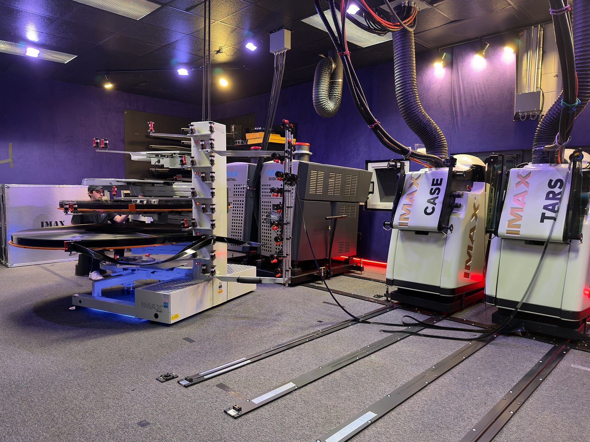

מתי בפעם האחרונה יצאתם מהקולנוע והרגליים נרדמו לכם? אם זה קרה לאחרונה, כנראה נפלתם בדיוק על המגמה הגדולה של הקולנוע העכשווי: **הסרט הארוך**. בעוד שסלון הבית מאמן אותנו לצרוך תוכן בקטעים של דקה, אולמות הקולנוע דווקא נמתחים לכיוון ההפוך — שלוש שעות הפכו כמעט לסטנדרט חדש בכל סרט שמתיימר להיות 'חשוב'. איך זה קרה, ומה זה אומר עלינו כצופים?

## למה כולם מדברים על אורך הסרט?

התשובה הקצרה: כי האורך הפך להצהרה. כשכריסטופר נולאן שחרר את 'אופנהיימר' בגרסה של כשלוש שעות, הקהל לא ברח — הוא נהר. הסרט הפך לאירוע תרבותי, נדון בטורים ובפודקאסטים, ונצפה שוב ושוב. באותה עונה הקרין מרטין סקורסזה את 'רוצחי הירח המלא' (Killers of the Flower Moon) באורך של מעל שלוש שעות וחצי, ובמקום להתנצל על כך, הפך את משך הזמן לחלק מהאמירה: סיפור עוול היסטורי שדורש נשימה ארוכה, לא תקציר.

זה כבר לא חריג. זה דפוס. מ'הבארבי' של גרטה גרוויג ועד סרטי מארוול המנופחים, ומהקולנוע ההודי הפופולרי ועד הדרמות של פסטיבל קאן — התחושה היא שהזמן על המסך התרחב. הסרט הארוך חדל להיות מכשול ונעשה תו תקן של יוקרה.

## מה מניע את חזרת הסרט הארוך?

### הצהרת אמן מול אלגוריתם

יש כאן מרד שקט. בעידן שבו פלטפורמות סטרימינג מודדות כל שנייה ומפחדות שהצופה יגלול הלאה, במאי שמתעקש על שלוש שעות בחושך מוחלט עושה מעשה כמעט פרובוקטיבי. הוא אומר: *הסיפור הזה שווה את זמנכם המלא*. נולאן, למשל, נלחם בגלוי על חוויית הצפייה בבית הקולנוע, על פילם אמיתי ועל מסכים גדולים — והאורך הוא חלק מאותה פילוסופיה.

### כלכלה של אירועים

בתי הקולנוע, שנאבקים על כל כרטיס, זקוקים לסיבה שתוציא אנשים מהבית. סרט 'רגיל' באורך שעה וחצי מרגיש כמו משהו שאפשר לחכות לו בסטרימינג. לעומת זאת, יצירה מונומנטלית בת שלוש שעות משדרת אירוע חד-פעמי — כזה שחייבים לחוות על מסך ענק ובמערכת סאונד רועמת. האורך, פרדוקסלית, הפך לטיעון שיווקי.

### חופש יצירתי של הבמאים הגדולים

כשבמאי מוכיח את עצמו קופתית, האולפנים נותנים לו חבל ארוך יותר — פשוטו כמשמעו. סקורסזה, טרנטינו ונולאן זכו למעמד שמאפשר להם לחתוך פחות ולשמר יותר. התוצאה היא סרטים שמרגישים לעיתים כמו רומנים קולנועיים מלאים, ולעיתים כמו יצירות שהיה כדאי לקצר.

## הסרט הארוך: יתרון או יומרה?

כאן מתחילה המחלוקת. יש הטוענים שהאורך משרת את הסיפור — שדמות זקוקה לזמן כדי להבשיל, שאירוע היסטורי דורש הקשר, ושחוויה סוחפת נבנית מהצטברות איטית. אחרים רואים באורך המתמשך סימן ליוהרה: העדר עריכה אמיצה, אמון עצמי מופרז, וזלזול מסוים בסבלנות הקהל.

האמת, כרגיל, נמצאת באמצע. סרט ארוך ומהודק כמו 'אופנהיימר' טס. סרט ארוך ורופף גורם לך לבדוק את השעון כבר בשעה השנייה. האורך עצמו אינו מעלה ואינו חיסרון — הוא כלי, והשאלה היחידה היא האם הבמאי יודע להשתמש בו.

## טבלה: כמה באמת נמתח הקולנוע?

| סרט | במאי | משך משוער | תחושת האורך |
|------|-------|------------|---------------|
| אופנהיימר | כריסטופר נולאן | כ-3 שעות | חולף במהירות מפתיעה |
| רוצחי הירח המלא | מרטין סקורסזה | מעל 3.5 שעות | סוחף אך תובעני |
| בארבי | גרטה גרוויג | כשעתיים | קצבי ומהודק |
| היה היה בהוליווד | קוונטין טרנטינו | כ-2.5 שעות | מתמסמס ומהנה |

*הזמנים מובאים כהערכה כללית ועשויים להשתנות בין גרסאות והפצות.*

## מה זה אומר עלינו כצופים?

המגמה הזו חושפת דבר מעניין על הפסיכולוגיה שלנו. אנחנו מתלוננים שאין לנו סבלנות, שהריכוז התקצר, שהכול נבלע בגלילה אינסופית — ובכל זאת, כשמציעים לנו חוויה עמוקה ומרוכזת, אנחנו משתוקקים אליה. הסרט הארוך הפך למעין תרגול נגדי: ויתור מודע על ההסחות, שלוש שעות של נוכחות מלאה בחושך, בלי טלפון, בלי הפסקות.

יש בזה משהו כמעט טקסי. הישיבה הממושכת באולם, כמו קונצרט קלאסי או הצגת תיאטרון ארוכה, הפכה לאקט של התנגדות תרבותית לקיטוע המתמיד. ואולי דווקא בזה טמון סוד ההצלחה: לא למרות האורך, אלא בגללו.

## אז לאן הולך מכאן הקולנוע?

הסבירות היא שהמגמה תימשך, לפחות בקרב היוצרים הגדולים ובעונת הפרסים. כל עוד סרטים ארוכים מוכיחים את עצמם קופתית ותרבותית, האולפנים ימשיכו לאשר אותם. אבל יש גם סכנה: אם האורך יהפוך לאופנה ריקה, לסטטוס במקום לצורך אמנותי, נגלה במהרה אולמות מלאים בסרטים שהיו יכולים להיות טובים בהרבה — בחצי שעה פחות. בינתיים, כדאי להצטייד בסבלנות, ואולי גם בכרית קטנה למושב.
