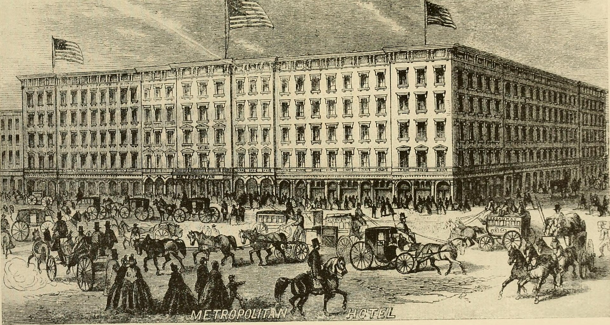

## מה זה בעצם תיאטרון אימרסיבי?

תארו לעצמכם שאתם נכנסים לבניין נטוש, מקבלים מסכה, ומשם ואילך אתם חופשיים לשוטט בין חדרים אפלוליים שבהם מתרחשות סצנות במקביל — כאן דמות בורחת במעלה מדרגות, שם זוג רוקד בחדר שינה מואר בנרות. **תיאטרון אימרסיבי** (Immersive Theatre) הוא סוגה תיאטרלית שמוחקת את הגבול המקודש בין הבמה לאולם, והופכת את הצופה מיושב פסיבי לחלק פעיל מן ההתרחשות. אין כאן שורה שלישית ואין וילון: אתם בתוך הסיפור.

זו התשובה הקצרה. התשובה הארוכה מעניינת הרבה יותר, כי היא נוגעת בשאלה עמוקה על מה אנחנו מחפשים כשאנחנו יוצאים מהבית לערב תרבות — ולמה, בעידן שבו כל חוויה זמינה במסך, דווקא הנוכחות הפיזית והבלתי אמצעית חוזרת להיות מבוקשת.

## איך הגענו לכאן?

התיאטרון תמיד שיחק עם הגבול בין אשליה למציאות, אבל הגל האימרסיבי המודרני התגבש בעיקר בשני העשורים האחרונים. להקת פאנצ'דראנק (Punchdrunk) הבריטית נחשבת לחלוצה של הסוגה, וההפקה הנודעת שלה 'Sleep No More' — עיבוד חופשי ל'מקבת' של שייקספיר שהתרחש במבנה ענק בניו יורק — הפכה לתופעה בינלאומית ולמודל שרבים ניסו לחקות.

מאז צצו ברחבי העולם הפקות שמזמינות את הקהל לנוע במרחב, לפתוח מגירות, לקרוא מכתבים ולעיתים אף לשוחח עם הדמויות. הרעיון המרכזי פשוט ורדיקלי כאחד: **במקום שהבמאי יכתיב לכם לאן להביט, אתם מחליטים בעצמכם**. שני צופים באותה הצגה עשויים לצאת עם שני סיפורים שונים לחלוטין.

### למה זה עובד על הדור הצעיר?

לא במקרה המגמה פורחת דווקא עכשיו. דור שגדל על משחקי מחשב, על חדרי בריחה ועל חוויות אינטראקטיביות מצפה למעורבות, לא לצפייה מהצד. תיאטרון אימרסיבי מדבר בשפה הזאת: הוא מציע אוטונומיה, סקרנות ותחושה של הרפתקה אישית. במובן מסוים, זו התשובה של התיאטרון החי לפיתוי המסכים.

## תיאטרון אימרסיבי בישראל

גם בישראל ניכרת בשנים האחרונות מגמה גוברת של הצגות שיוצאות מהאולם המסורתי אל מרחבים לא שגרתיים — מחסנים, בתים פרטיים, גגות ורחובות. **פסטיבל עכו לתיאטרון אחר** היה מאז ומעולם מעבדה לסוגות ניסיוניות, ובכללן הצגות אתריות (site-specific) שמנצלות את הסמטאות והמרחבים ההיסטוריים של העיר העתיקה. גם מוסדות ותיקים יותר מתנסים בפורמטים חוץ-אולמיים ובעבודות שמזמינות את הקהל להתקרב, לגעת ולהשתתף.

האתגר הישראלי כפול: מצד אחד תקציבים צנועים יחסית להפקות ראווה בסגנון פאנצ'דראנק, ומצד שני קהל סקרן שאוהב אינטימיות ומעורבות. התוצאה היא לרוב הפקות קאמריות, מבוססות מרחב, שמעמידות במרכז את המפגש האנושי הבלתי אמצעי.

## מדריך קצר: סוגי חוויה אימרסיבית

לא כל הצגה אימרסיבית זהה. הנה מפה מהירה שתעזור לכם לבחור לפי סוג הצופה שאתם:

| סוג החוויה | מה קורה בפועל | למי זה מתאים |
| --- | --- | --- |
| שיטוט חופשי | הקהל נע במרחב ובוחר סצנות | סקרנים שאוהבים לחקור |
| השתתפות מודרכת | הצופה מקבל תפקיד או משימה | אמיצים שלא חוששים מזרקור |
| הצגה אתרית | ההצגה מתרחשת במקום אמיתי (בית, רחוב) | חובבי אווירה ומקום |
| חוויה אינטימית | מספר צופים מצומצם, לעיתים אחד | מי שמחפש קרבה רגשית |

## מה מרוויחים — ומה מפסידים?

היתרון הברור הוא העוצמה הרגשית. כשאתם עומדים מטר מדמות בוכה, בלי מרחק בטוח של אולם, החוויה חודרנית ובלתי נשכחת. יש כאן גם ממד של משחק ושל בחירה שמעניק לכל ערב תחושת ייחודיות.

מנגד, יש ויתורים. **עלילה סדורה** לעיתים נמסה לטובת אווירה ורסיסים; מי שאוהב סיפור לינארי ומהודק עלול לצאת מבולבל. יש גם צופים שחשים אי-נוחות מהדרישה למעורבות פעילה — לא כולם רוצים שיפנו אליהם באמצע ההצגה. ולבסוף, הפורמט תובעני מבחינה פיזית: לעיתים עומדים והולכים שעה וחצי רצופה.

העצה שלנו פשוטה: לכו עם ראש פתוח, נעליים נוחות, ובלי ציפייה למבנה של הצגה קלאסית. תנו לעצמכם ללכת לאיבוד קצת — זה בדיוק הרעיון.

## למה זה כאן כדי להישאר

תיאטרון אימרסיבי אינו גימיק חולף אלא ביטוי לצורך עמוק: בעולם מרוכך ומתוּוך על ידי מסכים, אנשים משתוקקים לחוויה שאי אפשר לצלם, לשתף או לגלול הלאה. הנוכחות הפיזית, הסיכון של המפגש הלא-צפוי, האפשרות שההצגה תיגע בכם ממש — כל אלה הופכים את הסוגה למרתקת במיוחד לקהל הישראלי הצמא לחוויות אמיתיות. הבמה יצאה מהמסגרת, והקהל, מסתבר, שמח להיכנס פנימה.
