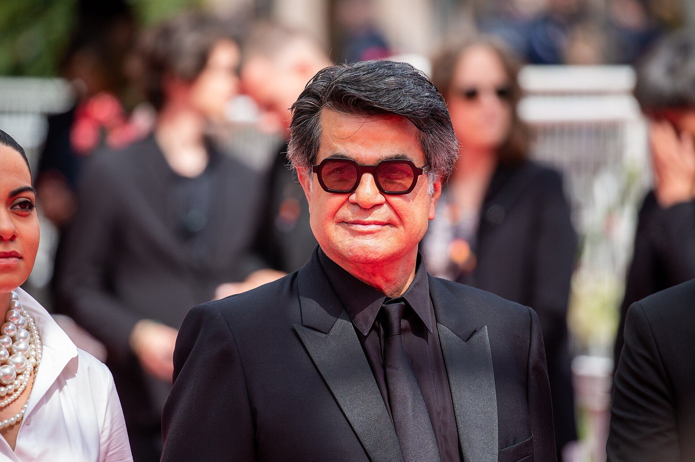

שלוש שעות. זה הזמן שלוקח היום לצפות בסרט קולנוע ממוצע מבית היוצר של הוליווד היוקרתית — וזו בדיוק הסיבה שהמונח **סרטים ארוכים** הפך מקללה לתו איכות. אם פעם מפיץ היה נלחם על כל דקה מעבר לשעתיים, הרי שבשנים האחרונות אורך הסרט הפך לחלק מהמותג של היצירה עצמה. השאלה המתבקשת: האם אנחנו עדים לתור זהב של קולנוע שאפתני, או שהתעשייה פשוט איבדה את כפתור העריכה?

## למה הסרטים נעשו כל כך ארוכים?

התשובה הקצרה: כי הם יכולים. ההסבר המורכב יותר נעוץ במפגש בין כמה כוחות. ראשית, במאי-על שהשיגו חופש יצירתי מלא — כריסטופר נולאן, מרטין סקורסזה, קוונטין טרנטינו — כבר לא נדרשים להתפשר. כשסרט כמו "אופנהיימר" חוצה את רף שלוש השעות ובכל זאת כובש את הקופות, נשלח מסר ברור לכל האולפנים: הקהל מוכן לשבת.

שנית, עידן הסטרימינג שינה את מערכת הציפיות. אחרי שנים של צפייה בבינג' של עונות שלמות, שלוש שעות רצופות כבר לא מרתיעות. פרדוקסלית, דווקא נטפליקס ואמזון — שנחשדו בקיצור טווח הקשב — מימנו יצירות ארוכות במיוחד של יוצרים בכירים, מתוך רצון למשוך יוקרה ופרסים.

### מהצהרת אמנות ועד יומרנות

יש שיטענו שהאורך הוא ביטוי לעומק: סיפור שמסרב להצטמצם, דמויות שמקבלות מרחב לנשום, קצב שמאפשר לרגעים לשקוע. סקורסזה, בסרטו "רוצחי הירח" (Killers of the Flower Moon), השתרע על פני יותר משלוש וחצי שעות והפך את משך הזמן עצמו לחלק מהחוויה הרגשית — תחושת כובד היסטורי שאי אפשר לזרז.

מנגד, לא מעט מבקרים רואים במגמה סימן לאובדן משמעת. סרט ארוך אינו בהכרח סרט עשיר; לעיתים הוא פשוט סרט שלא נערך מספיק. הקו הדק בין אפיוּת לבין התמכרות עצמית עובר בדיוק כאן.

## הסרטים שהגדירו את המגמה

כדי להבין את קנה המידה, כדאי להביט בכמה מהיצירות הבולטות שהזינו את עידן הסרטים הארוכים ואת האופן שבו הקהל קיבל אותן.

| הסרט | הבמאי | אורך משוער | קבלת הפנים |
|------|--------|-------------|-------------|
| אופנהיימר | כריסטופר נולאן | כ-3 שעות | הצלחה מסחרית וביקורתית יוצאת דופן |
| רוצחי הירח | מרטין סקורסזה | כ-3.5 שעות | שבחים על העומק, ביקורת על האורך |
| הוליווד בימים עברו | קוונטין טרנטינו | כ-2.75 שעות | להיט אניני טעם |
| באבילון | דמיאן שאזל | כ-3 שעות | מקטב במיוחד |

הטבלה חושפת דפוס מעניין: כמעט כל הסרטים הללו הם יצירות "מחבר" (auteur), שבהן שם הבמאי הוא הכרטיס הנמכר. האורך אינו תקלה אלא חתימה.

## איך זה משפיע על חוויית הצפייה?

כאן מתחילה ההשפעה המעשית על כולנו. סרט של שלוש שעות משנה את כללי המשחק של היציאה לקולנוע. הוא הופך אותה מבילוי מזדמן לאירוע מתוכנן — יש מי שמדלגים על משקאות כדי לא להיאלץ לצאת באמצע, ויש בתי קולנוע ברחבי העולם ששוקלים הפסקות אמצע כמו בימים עברו.

בישראל, שבה הסינמטקים בתל אביב, בירושלים ובחיפה מהווים בית טבעי לקולנוע השאפתני, הקהל דווקא מגלה סבלנות. צופה שמגיע במיוחד לסרט של אלמודובר, של פול תומאס אנדרסון או להקרנה חגיגית בפסטיבל, מגיע מלכתחילה בציפייה לחוויה טוטאלית ולא לנשנוש קליל.

### האם הקהל הישראלי באמת אוהב את זה?

המציאות מפוצלת. מצד אחד, סרטי הבלוקבאסטר הארוכים ממלאים אולמות בסופי שבוע. מצד שני, לא מעט צופים מודים בשקט שהם מעדיפים להמתין ולצפות בבית, שם אפשר לעצור, לעשות הפסקה ולחזור. דווקא הנוחות הביתית עלולה, בטווח הארוך, לפגוע בסרטים הארוכים בבתי הקולנוע — אלא אם היוצרים יצליחו לשכנע שהאורך הוא בדיוק מה שמצדיק את המסך הגדול.

## אז לאן זה הולך?

המגמה כנראה לא תיעלם בקרוב. כל עוד סרטים שאפתניים ממשיכים לזכות בפרסים ובכבוד, במאים ימשיכו לתבוע לעצמם את הזכות למתוח את הסיפור. השאלה האמיתית אינה כמה זמן נשב, אלא האם כל דקה מרוויחה את מקומה. סרט ארוך שכל רגע בו הכרחי הוא מתנה; סרט ארוך שסתם מתמשך הוא מבחן סבלנות. ההבדל ביניהם, בסופו של דבר, הוא כל ההבדל שבין קולנוע גדול לקולנוע מנופח.
