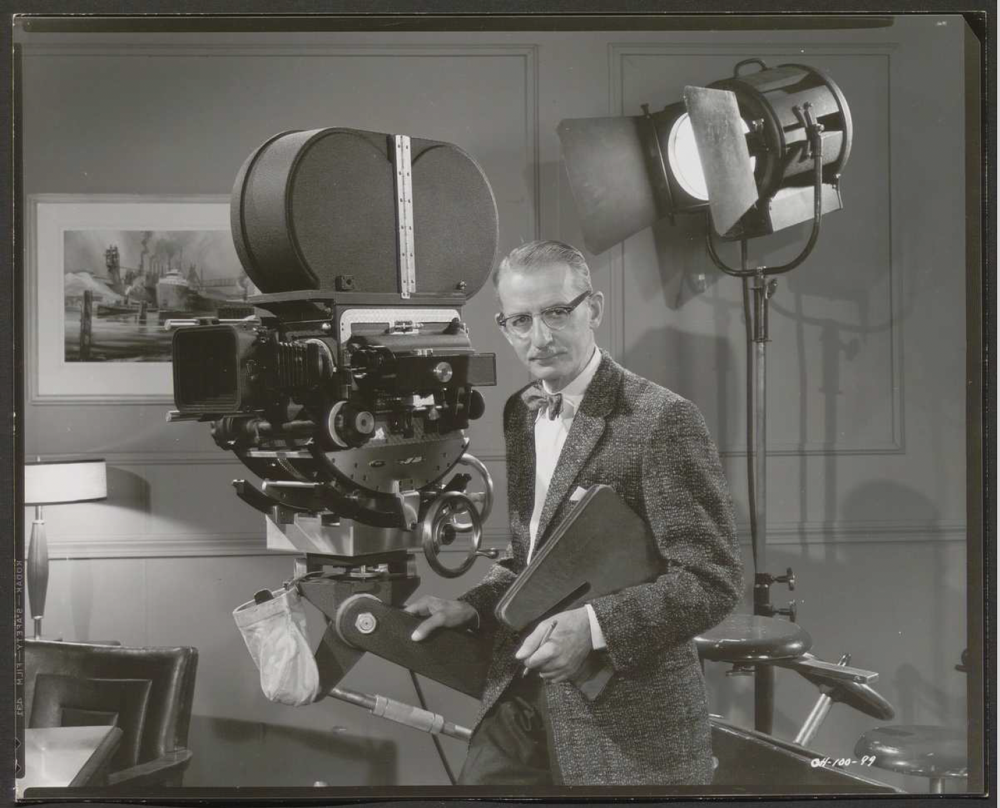

מתי בפעם האחרונה יצאתם מסרט והרגליים נרדמו? אם זה קרה לאחרונה, כנראה שנפלתם קורבן למגמה הבולטת בקולנוע העכשווי: **סרטים ארוכים**, ארוכים מאוד. שלוש שעות הפכו כמעט לתקן החדש בקרב סרטי הפרסטיז', ומה שנחשב פעם לחריגה שמורה לאפוסים היסטוריים הפך לשפה של יוקרה קולנועית. התשובה הקצרה לשאלה "למה": האורך הפך לאמירה — הצהרה של רצינות, שאפתנות והתנגדות לעידן הצפייה הקצוצה.

## למה סרטים ארוכים חזרו לאופנה?

במשך שנים רדפו האולפנים אחר זמן ריצה של שעה וחצי עד שעתיים, מתוך הנחה שקהל חסר סבלנות ינטוש. אבל משהו התהפך. ההצלחה המסחררת של "אופנהיימר" של כריסטופר נולאן, סרט של כשלוש שעות שמילא אולמות, שידרה מסר ברור: קהל מוכן להתחייב לחוויה ארוכה אם היא נתפסת כאירוע.

מרטין סקורסזה מתח את הגבול עוד יותר עם "רוצחי הירח המלא", דרמה בת שלוש שעות וחצי, והצדיק זאת בטענה שסיפור גדול דורש נשימה גדולה. גם "הברוטליסט" (The Brutalist), הדרמה האפית שסחפה את עונת הפרסים, החזירה את המושג הנשכח **אינטרוול** — הפסקה באמצע ההקרנה — כאילו חזרנו לימי הזוהר של הוליווד.

### האם זו אמנות או אגו?

כאן מתחילה הביקורת. יש הטוענים שהאורך המנופח הוא לא תמיד הכרח דרמטי אלא ביטוי לכוח: כשבמאי הופך לכוכב, מפיקים מהססים לגעת בעריכה. סרטים שיכולים היו להתהדק בחצי שעה נשארים תפוחים בשם החזון. מנגד, מגיני המגמה טוענים שדווקא זמן הריצה הארוך מאפשר לדמויות להתפתח לאט, לבנות עולם שלם ולהעניק תחושת מונומנטליות שאי אפשר לדחוס לתשעים דקות.

## הצפייה הביתית שינתה את המשוואה

פרדוקס מעניין: בעידן שבו טיקטוק ורילס מאמנים אותנו לסרטונים של חמש עשרה שניות, הקולנוע נע לכיוון ההפוך בדיוק. הסטרימינג תרם לכך — פלטפורמות כמו נטפליקס ואפל טיוי אפשרו לבמאים כמו סקורסזה חופש יצירתי בלי מגבלות זמן מסחריות נוקשות. כשהסרט ממילא נצפה בסלון, האורך הפך לפחות בעייתי.

אבל דווקא בזכות זה, ההקרנה בבית הקולנוע חזרה להיות אירוע יוקרתי. לשבת שלוש שעות באולם חשוך, בלי טלפון, הפכה לאקט של התנגדות תרבותית — ריכוז עמוק בעולם שרווי הסחות דעת.

## טבלה: סרטים ארוכים שהגדירו את המגמה

| הסרט | הבמאי | זמן ריצה מקורב | הערה |
|---|---|---|---|
| אופנהיימר | כריסטופר נולאן | כ־3 שעות | הצלחת קופות שהוכיחה את המגמה |
| רוצחי הירח המלא | מרטין סקורסזה | כ־3.5 שעות | אפוס בהפקת סטרימינג |
| הברוטליסט | בריידי קורבט | מעל 3.5 שעות | החזיר את האינטרוול לאולם |
| בבילון | דימיאן שאזל | כ־3 שעות | חגיגה קולנועית שסחפה ביקורות מעורבות |

## מה זה אומר על חוויית הצפייה שלנו?

המעבר לזמני ריצה ענקיים מעורר שאלות מעשיות. מחיר כרטיס לשלוש שעות, נגישות למשפחות עם ילדים, ואפילו סוגיית הפסקת השירותים — כל אלה חוזרים לשולחן. חלק מהרשתות מנסות פתרונות: כיסאות נוחים יותר, מושבים שמורים והחזרת האינטרוול המסורתי.

מעבר לכך, יש כאן שאלה תרבותית עמוקה יותר. האם היכולת שלנו לשבת בריכוז אורך שעות היא כישור שהולך ונעלם, או שהקולנוע דווקא מתפקד כחדר כושר לקשב? רבים רואים במגמה הזו תגובת נגד בריאה לעידן התוכן המהיר — הזמנה להאט, לצלול ולתת ליצירה את הזמן שהיא דורשת.

## אז שווה לשבת שלוש שעות?

התשובה תלויה בסרט. סרט ארוך שמנצל כל דקה — כמו האפוסים של סקורסזה — יכול להיות חוויה מטלטלת שנשארת איתך ימים. סרט ארוך שלא מצדיק את משך הזמן הופך לתרגיל בסבלנות. העצה שלנו: בדקו זמן ריצה מראש, שתו קפה, ותנו לעצמכם ליהנות מהמותרות הנדירות של להתמסר לסיפור אחד לאורך ערב שלם. בעולם שרץ מהר מדי, אולי הסרט הארוך הוא בדיוק מה שאנחנו צריכים.
