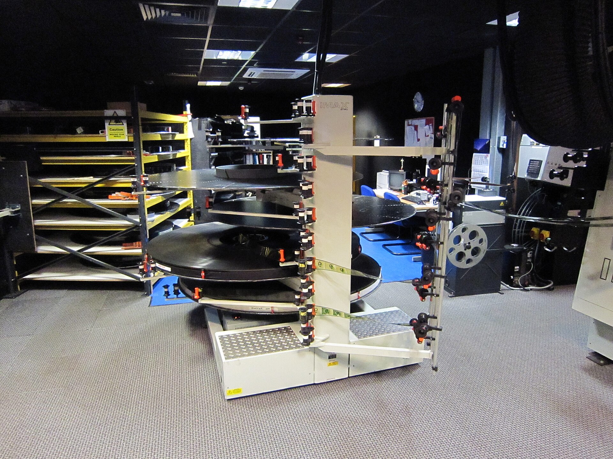

מי שקנה כרטיס לקולנוע בשנה האחרונה גילה משהו מוזר: הסרטים פשוט לא נגמרים. **הסרט הארוך** — יצירה שחוצה בקלות את רף השעתיים וחצי ולעיתים נוגעת בשלוש וחצי — הפך מחריגה תובענית לברירת המחדל של קולנוע היוקרה. מ"אופנהיימר" של כריסטופר נולאן ועד "רוצחי הירח המלא" של מרטין סקורסזה, נראה שהאורח האפי חזר לשבת בכיסא הבמאי.

התשובה הקצרה: מדובר בשילוב של אמביציה אמנותית, אסטרטגיה שיווקית ורצון של יוצרים לבדל את חוויית האולם מהזרם האינסופי של המסכים הקטנים. אבל מתחת לפני השטח מסתתרת שאלה מסקרנת הרבה יותר — למה דווקא עכשיו, בעידן שבו כולם מתלוננים על קוצר הריכוז, אנחנו מוכנים להתמסר לישיבה כה ארוכה.

## מתי הסרט הארוך חזר לאופנה?

האורך מעולם לא היה זר לקולנוע. "חלף עם הרוח", "לורנס איש ערב" ו"הסנדק" ביססו מזמן את הרעיון שיצירת מופת ראויה לזמן. אבל בעשורים האחרונים, כשהאולפנים רדפו אחרי מספר הקרנות ביום, נדחקו הסרטים הארוכים לשוליים. מה שהשתנה הוא שהבמאים החזקים ביותר בהוליווד הפכו את המשך להצהרה.

כשמרטין סקורסזה מגיש סרט של שלוש שעות וחצי, הוא לא מבקש סליחה — הוא מכריז שזהו אירוע. כשכריסטופר נולאן מצלם בפורמט אנלוגי רחב ומתעקש על הקרנה במסך ענק, האורך הופך לחלק בלתי נפרד מהיוקרה. גם דני וילנב ב"חולית", גם גרטה גרוויג וגם יוצרים מהקולנוע האסייתי — כולם אימצו את הנשימה הארוכה.

### האם זו רק יומרה של במאים?

לא בהכרח. חלק מהסיפורים פשוט דורשים מרחב. מונומנטים היסטוריים, דרמות דמויות רבות-משתתפים ומחקרי אופי מעמיקים לא תמיד נכנסים לתבנית של תשעים דקות. עם זאת, קשה להתעלם מכך שהאורך הפך גם לסמל סטטוס: ככל שהסרט ארוך יותר, כך הוא נתפס כ"רציני" ו"חשוב" יותר — גם כשלא כל דקה מוצדקת.

## מדוע הקהל דווקא מתמסר?

כאן טמון הפרדוקס המרתק. אותו קהל שגולל סרטונים בני חמש עשרה שניות ומדלג על פרסומות, מוכן פתאום לכבות את הטלפון לשלוש שעות. ההסבר, כפי שרבים רואים אותו, הוא שהאורך הפך לחוויה הפוכה מהיומיום הדיגיטלי המקוטע — מעין דטוקס תרבותי, טקס של ריכוז מוחלט.

הישיבה הארוכה באולם החשוך הפכה לאקט מכוון של האטה. בסינמטק תל אביב ובבתי הקולנוע העצמאיים ניתן להרגיש זאת היטב: הצופים מגיעים בכוונה תחילה לחוויה שאי אפשר להשיג בסלון. האורך אינו מכשול — הוא חלק מהפיתוי.

## הסרטים הארוכים שכדאי להכיר

הטבלה הבאה מרכזת כמה מהיצירות הבולטות שהזינו את המגמה, לצד הבמאים והמשך המשוער — תזכורת לכך שהאורך חוצה ז'אנרים ותרבויות.

| הסרט | הבמאי | משך משוער | הערה |
|------|-------|-----------|------|
| אופנהיימר | כריסטופר נולאן | כשלוש שעות | דרמה היסטורית שצולמה בפורמט רחב |
| רוצחי הירח המלא | מרטין סקורסזה | כשלוש וחצי | אפוס פשע ומצפון |
| חולית: חלק שני | דני וילנב | כשלוש שעות | מדע בדיוני מונומנטלי |
| הסרט האירי | מרטין סקורסזה | כשלוש וחצי | דרמת מאפיה מתפרשת על עשורים |
| בבילון | דיימיאן שאזל | כשלוש שעות | הומאז' פרוע להוליווד הישנה |

## מה המחיר של הנשימה הארוכה?

למגמה יש גם צד מפוכח. עבור בתי הקולנוע, סרט ארוך משמעו פחות הקרנות ביום ופחות הכנסות — אתגר כלכלי אמיתי בתקופה שממילא אינה קלה לאולמות. עבור הצופים, ישיבה של שלוש שעות דורשת התחייבות שלא כולם יכולים או רוצים לתת, בעיקר משפחות והורים.

וישנה גם שאלת העריכה. **לא כל סרט ארוך הוא סרט טוב**, ולעיתים האורך מסווה חוסר משמעת יצירתית יותר משהוא משרת את הסיפור. המבקרים הטובים ביותר יזכירו תמיד שיצירת מופת אינה נמדדת בדקות אלא במה שהיא עושה בהן.

ובכל זאת, כשהאורות כבים והסרט הארוך פורש את כנפיו האפיות, יש בכך משהו שמזכיר לנו למה בכלל הלכנו לקולנוע מלכתחילה — לא כדי להעביר את הזמן, אלא כדי לאבד אותו לגמרי.
