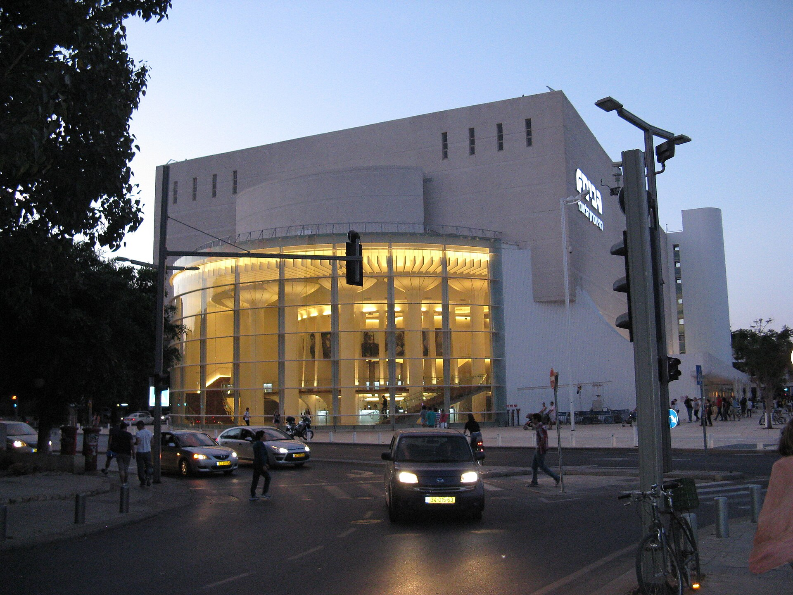

מה קורה כשמסירים את המחיצה הבלתי נראית שמפרידה בין הבמה לאולם? התשובה היא **תיאטרון אימרסיבי** — ז'אנר שבו הצופה אינו יושב בכורסה ומביט קדימה, אלא קם, מסתובב בתוך החלל, מציץ לחדרים, עוקב אחרי דמות לפי בחירתו ולעיתים אף נדרש לקחת חלק פעיל בעלילה. זו אינה הצגה שרואים; זו הצגה שחיים בתוכה. בשנים האחרונות המגמה הזו הפכה לאחת המרתקות בעולם התיאטרון, והיא מתחילה לחלחל גם אל הבמות הישראליות.

## מהו תיאטרון אימרסיבי בעצם?

תיאטרון אימרסיבי (Immersive Theatre) הוא כל הפקה שמטרתה לטבול את הצופה בתוך עולם ההצגה באופן מוחשי. במקום שורות של מושבים מול במה מוארת, הצופים מוזמנים לנוע בחופשיות במרחב — לעיתים על פני כמה קומות, חדרים ומסדרונות — בזמן שהסצנות מתרחשות סביבם בו-זמנית. אין נקודת מבט אחת "נכונה": שני צופים שנכנסו לאותה הצגה עשויים לצאת עם שתי חוויות שונות לחלוטין, פשוט כי בחרו לעקוב אחרי דמויות אחרות.

העיקרון המכונן של הז'אנר הוא **השתתפות**. לעיתים מדובר בהשתתפות עדינה — נוכחות בלבד בתוך הסצנה — ולעיתים בהשתתפות של ממש, כשהצופה מתבקש לפתוח מגירה, לקרוא מכתב או לדבר עם שחקן. התחושה היא של חלום שבו אתה בו-זמנית צופה ושחקן משנה.

## מאיפה הגיעה המגמה?

את פריצת הדרך הבינלאומית מזהים רבים עם הלהקה הבריטית **פאנצ'דראנק** (Punchdrunk) והפקתה האגדית "שלא תישן עוד" (Sleep No More) — עיבוד נועז למקבת' של שייקספיר, שהתרחש בבניין בן חמש קומות בניו יורק שעוצב כמלון אפל משנות הארבעים. הצופים, עטויי מסכות לבנות, שוטטו בחופשיות בין החדרים ובחרו בעצמם את מסלול הצפייה. ההצלחה חוללה גל עולמי של חיקויים ומחקרים, והפכה את האימרסיביות למילת מפתח בשיח התיאטרלי.

מאז התרחב הז'אנר לכל כיוון: מהצגות בלשיות אינטראקטיביות, דרך חדרי בריחה שהתחברו לדרמה, ועד חוויות מבוססות מציאות רבודה. המשותף לכולן — הרצון לשבור את הפסיביות של הצופה המודרני, שרגיל ממילא לגלול, ללחוץ ולבחור.

## למה דווקא עכשיו, ולמה בישראל?

העלייה של **תיאטרון אימרסיבי** אינה מקרית. בעידן שבו הבידור הביתי זמין בשפע, התיאטרון מחפש את מה שאי אפשר לשחזר על מסך: נוכחות פיזית, הפתעה בלתי-אמצעית, חוויה חד-פעמית שלא ניתנת לצפייה חוזרת. האימרסיביות מציעה בדיוק את זה — סיבה לקום מהספה.

בישראל המגמה נראית בעיקר בבמות הפרינג' ובפסטיבלים נסיוניים, שם יוצרים צעירים מתנסים בחללים לא שגרתיים — מחסנים בדרום תל אביב, מבנים נטושים ואפילו דירות פרטיות. מוסדות מבוססים כמו הקאמרי, הבימה ותיאטרון גשר מגששים אף הם לעבר אלמנטים חווייתיים, גם אם בזהירות. הקהל הישראלי, שתמיד אהב מעורבות וספונטניות, מתגלה כקרקע פורייה במיוחד.

## השוואה: תיאטרון קלאסי מול אימרסיבי

| מאפיין | תיאטרון קלאסי | תיאטרון אימרסיבי |
|---|---|---|
| מיקום הצופה | כורסה מול הבמה | בתוך החלל, נע בחופשיות |
| נקודת מבט | אחידה לכולם | אישית ומשתנה |
| מעורבות | פסיבית | פעילה, לעיתים משתתפת |
| חלל ההצגה | אולם מסורתי | מבנה, מחסן, דירה, אתר |
| חוויה חוזרת | זהה בכל צפייה | שונה בכל ביקור |

## איך מתכוננים לערב של תיאטרון חווייתי?

אם מעולם לא חוויתם הצגה כזו, כמה עצות שיעזרו להפיק את המרב:

- **לבשו בגדים ונעליים נוחים** — תעמדו ותלכו הרבה.
- **היו סקרנים ואמיצים** — אל תפחדו להתרחק מהקבוצה ולעקוב אחרי דמות שמסקרנת אתכם.
- **שחררו את הצורך לראות הכל** — אי אפשר, וזה בדיוק היופי.
- **כבדו את כללי ההפקה** — יש הצגות שמזמינות מגע ויש כאלה שדורשות שתיקה וריחוק.

## האתגר שמאחורי הקסם

לצד ההתלהבות, הז'אנר מציב שאלות לא פשוטות. כשהצופה אחראי על חוויית הצפייה שלו, איך מבטיחים שהעלילה תישאר קוהרנטית ועמוקה? יש מבקרים הטוענים שלעיתים האפקט החושי גובר על הדרמה, ושהתחכום הטכני מאפיל על הכתיבה. ההפקות המוצלחות באמת הן אלו שמצליחות לשלב בין החוויה הפיזית לבין סיפור שראוי להיחוות — ולא רק מסדרון מרשים עם תאורה אווירתית.

ובכל זאת, קשה להתכחש לעוצמה. תיאטרון אימרסיבי מחזיר לבמה משהו ראשוני: את התחושה שמשהו קורה כאן ועכשיו, ושאתה חלק ממנו. בעולם שבו הכל מתווך דרך מסך, זו אולי ההבטחה הגדולה ביותר שהתיאטרון יכול לקיים.
