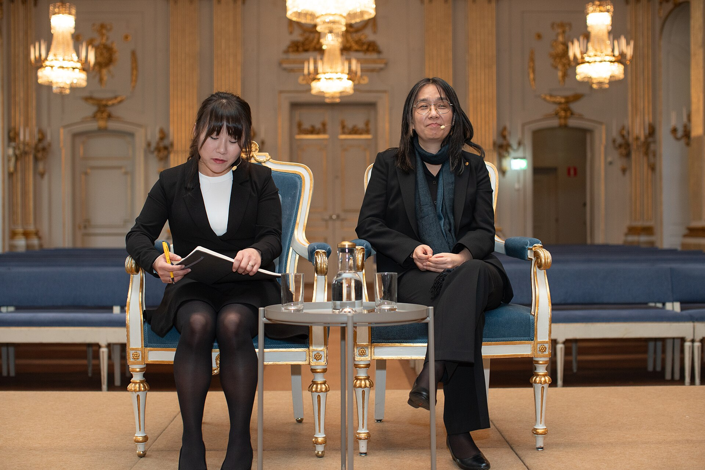

אם בשנים האחרונות נדמה לכם שכל מדף שני בחנות הספרים נצבע בכריכות מסיאול — אתם לא מדמיינים. **ספרות קוריאנית** הפכה לאחת התופעות הבולטות ביותר בעולם הספרים הישראלי: מרומנים נוקבים וקשים ועד רבי מכר מנחמים שמבטיחים כוס תה וחיבוק. התשובה הקצרה לשאלה מדוע זה קורה דווקא עכשיו טמונה בשילוב של הכרה ספרותית בינלאומית, גל תרבותי קוריאני רחב, וצמא ישראלי לסיפורים חדשים ושונים.

## למה הספרות הקוריאנית פורצת דווקא עכשיו?

הרגע המכונן הגיע עם זכייתה של **הן קאנג** (Han Kang) בפרס נובל לספרות — אירוע שהפך סופרת שכבר הייתה מוכרת לקהל מצומצם לשם בינלאומי. ספרה **'הצמחונית'**, סיפור מטריד על אישה שמחליטה להפסיק לאכול בשר ובכך מפרקת סביבה את כל המוסכמות המשפחתיות, כבר קטף בעבר את פרס הבוקר הבינלאומי ונחשב לאחת היצירות המדוברות של העשור.

אבל הן קאנג היא רק קצה הקרחון. הגל נשען על תשתית תרבותית רחבה הרבה יותר: ההצלחה העולמית של הקולנוע הקוריאני (ובראשו 'פרזיטים' של בונג ג'ון־הו), סדרות ששוברות שיאים בפלטפורמות הסטרימינג, ומוזיקת הפופ הקוריאנית. כל אלה יצרו סקרנות תרבותית שגלשה באופן טבעי גם אל המילה הכתובה.

## שני פנים של אותו גל

מה שמעניין במיוחד בגל הקוריאני הוא שהוא מחזיק בתוכו שני קטבים כמעט מנוגדים, וכל אחד מהם מוצא קהל נלהב משלו.

### הצד הנוקב והאפל

בקצה האחד ניצבת ספרות עילית, לעיתים אפלה ואלימה, שאינה חוששת לגעת בפצעים חברתיים. הן קאנג, למשל, עוסקת ביצירתה גם בטראומות היסטוריות ובאלימות הפוליטית בקוריאה. לצידה בולט הרומן **'קים ג'י־יונג, ילידת 1982'** של צ'ו נאם־ג'ו, שהפך לתופעה פמיניסטית וסימן את חוסר השוויון המגדרי בחברה הקוריאנית — ובתוך כך נגע בקוראות ברחבי העולם.

### הצד המנחם והחמים

בקצה השני פורחת מגמה הפוכה לחלוטין: ספרות ה'מרפא' המנחמת, אותם רומנים שקטים שמתרחשים בבתי קפה קטנים, בחנויות ספרים נידחות או במכבסות שכונתיות, ומבטיחים לקורא רוגע ונחמה. ספרים כמו 'חנות הספרים המקסימה בהיונם־דונג' הפכו לרבי מכר בינלאומיים בזכות האווירה העדינה והאופטימית שלהם — ניגוד מרתק לעוצמה של הן קאנג.

## מהיכן כדאי להתחיל? טבלת המלצות

למתלבטים בין הכותרים, הנה מפה קצרה שתעזור לבחור לפי מצב הרוח:

| הספר | הסופר/ת | למי זה מתאים |
|---|---|---|
| הצמחונית | הן קאנג | מי שמחפש ספרות עוצמתית ומטרידה |
| קים ג'י־יונג, ילידת 1982 | צ'ו נאם־ג'ו | קוראות וקוראים עם עניין חברתי־פמיניסטי |
| מעשי אנוש | הן קאנג | חובבי ספרות היסטורית ופוליטית |
| חנות הספרים בהיונם־דונג | הוואנג בו־רום | מי שמחפש נחמה וקריאה מרגיעה |

## מה אומר הגל הזה על הקורא הישראלי?

ההיענות הישראלית לספרות הקוריאנית מספרת סיפור מעניין על טעם הקהל המקומי. מצד אחד, יש כאן רעב להיכרות עם תרבות רחוקה ושונה, שאינה מערבית־אירופית או אמריקאית. מצד שני, הניגוד שבין הספרות הנוקבת לספרות המנחמת משקף בדיוק את מצב הרוח של התקופה: צורך בו־זמני להתעמת עם המציאות הכואבת ולברוח ממנה אל מרחב בטוח.

הוצאות הספרים בישראל זיהו את המגמה והגבירו קצב תרגום של כותרים מקוריאנית, לעיתים ישירות מהשפה המקורית ולא דרך האנגלית — צעד שמעיד על התבגרות הגל והפיכתו לנתח קבוע ומשמעותי מהמדף המתורגם.

## לאן זה הולך מכאן?

קשה לדעת אם מדובר בטרנד חולף או בשינוי עמוק יותר, אבל הסימנים מצביעים על עומק. הזכייה בנובל אינה אירוע חד־פעמי אלא נקודת שיא בתהליך ארוך של השקעה תרבותית קוריאנית ביצוא יצירה. כל עוד הקולנוע, המוזיקה והסדרות ממשיכים להזין את הסקרנות, סביר להניח שהספרות הקוריאנית תישאר נוכחת ובולטת על המדף הישראלי — וממשיכה להפתיע אותנו בין קוטב הכאב לקוטב הנחמה.
