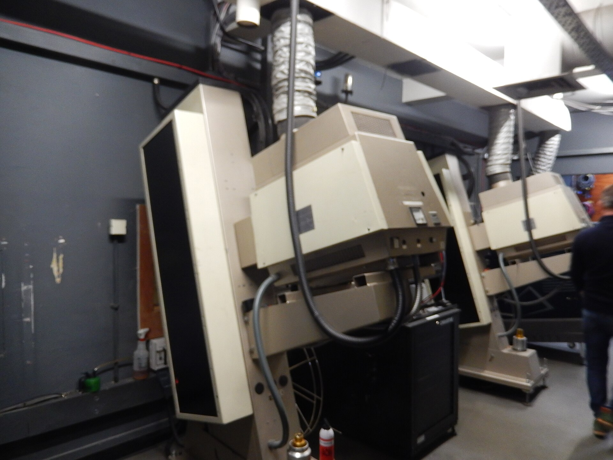

יש רגע מסוים, בערך בשעה השנייה וחצי של סרט, שבו אתה מתחיל לחשב כמה זמן נותר עד הקרדיטים. ובכל זאת, דווקא בעידן של ריכוז קצר וגלילה אינסופית, **הסרטים הארוכים חזרו לשלוט** — ולא רק חזרו, אלא הפכו לסמל סטטוס קולנועי. שלוש שעות על הכיסא כבר לא נחשבות לעונש אלא להצהרת כוונות: זהו סרט *חשוב*, יצירה שדורשת מאיתנו מחויבות.

התשובה הקצרה לשאלה מדוע זה קורה היא שילוב של שאפתנות יוצרים, כלכלה של יוקרה, ושינוי עמוק בהרגלי הצפייה שלנו. בואו נפרק את זה.

## למה סרטים ארוכים הפכו לאופנה?

בעשור האחרון הפך האורך לסוג של גביע. כשכריסטופר נולאן משחרר סרט של שלוש שעות על אבי פצצת האטום, או כשמרטין סקורסזה פורש אפוס של כשלוש שעות וחצי על פשע ובגידה באמריקה, המסר ברור: זהו קולנוע לא מתפשר. **סרטים ארוכים** הפכו לשפה שבה הבמאי אומר לצופה — אני לוקח אותך ברצינות, אז קח אותי ברצינות בחזרה.

יש בכך גם היגיון תעשייתי. בעונת הפרסים, יצירה מונומנטלית מושכת תשומת לב, מעוררת שיחה ומשדרת חשיבות. האורך עצמו הפך לחלק מהאירוע — לא עוד "סתם סרט" אלא חוויה שמצדיקה יציאה מהבית, כרטיס יקר ושעתיים וחצי של ניתוק מהטלפון.

## מה השתנה אצלנו, הצופים?

כאן נמצאת הפרדוקס המרתק. דווקא בדור שגדל על סרטונים של חמש עשרה שניות, רבים מוצאים נחמה דווקא בטבילה הארוכה. אחרי שנים של צפייה ביתית — שבה אנחנו עוצרים, חוזרים, בולעים עונה שלמה בלילה אחד — תפיסת הזמן שלנו מול המסך השתנתה. מי שמוכן לצפות בשמונה פרקים ברצף, לא באמת נרתע משלוש שעות.

פלטפורמות הסטרימינג שחררו את הבמאים מהכבלים הישנים של אורך "מסחרי". הדרישה ההיסטורית לקצר סרט כדי לדחוס עוד הקרנות ביום נחלשה, והיוצרים ניצלו את החופש. התוצאה: גרסאות הבמאי התארכו, וסצנות שפעם היו נופלות על רצפת חדר העריכה שרדו.

## האורך הגדול: יצירות שמסמנות את המגמה

הנה כמה מהסרטים שהפכו את האורך לחלק מהזהות שלהם — והפכו את הישיבה הארוכה לטקס.

| היצירה | הבמאי | אורך משוער | מה מצדיק את האורך |
|---|---|---|---|
| אופנהיימר | כריסטופר נולאן | כ-3 שעות | מתח מצטבר ומבנה שכבות כרונולוגי |
| רוצחי ירח הפרחים | מרטין סקורסזה | כ-3.5 שעות | אפוס היסטורי ובניית דמויות איטית |
| הברוטליסט | בריידי קורבה | מעל 3.5 שעות | סאגה דורית עם הפסקת אמצע |
| בבילון | דמיאן שאזל | כ-3 שעות | כאוס הוליוודי רחב יריעה |

שימו לב לפרט אחד מסקרן: **חזרת הפסקת האמצע**. סרטים מסוימים החזירו את האינטרמישן הישן, אותה הפוגה שבה הקהל קם, נושם ומותח רגליים. זו הודאה כנה בכך שגם חוויה סוחפת צריכה נקודת אוויר.

## האם ארוך יותר הוא בהכרח טוב יותר?

כאן מתחילה המחלוקת. לצד ההתפעלות נשמעת גם ביקורת נוקבת: האם האורך הפך לתירוץ? יש מי שטוענים שלא כל סרט ארוך ראוי לזמן שהוא דורש, ושלעיתים מתחבאת מאחורי שלוש השעות דווקא עצלות עריכה ולא עומק אמנותי. סרט הדוק של תשעים דקות יכול להכות חזק יותר מאפוס מרוח.

יש גם שאלה דמוקרטית. אורך קיצוני מקשה על הורים, על עובדים עייפים ועל מי שפשוט לא יכול לשבת שלוש שעות ברצף. הקולנוע הארוך, על אף יוקרתו, הוא גם קולנוע תובעני שמסנן קהל.

וּבכל זאת, יש משהו מרגש בעצם ההתעקשות. בעולם שבנוי על מיידיות, במאים שמבקשים מאיתנו שעה ועוד שעה ועוד חצי מציעים הצעה כמעט מרדנית: *תאטו*. תשהו. תנו לסיפור להתפתח בקצב שלו. ואולי זו בדיוק הסיבה שהקהל, למרות הכול, ממשיך לקנות כרטיס.

## מה הלאה?

נראה שהמגמה לא הולכת להתקצר בקרוב. כל עוד פסטיבלים כמו קאן וונציה ממשיכים להריע ליצירות מונומנטליות, וכל עוד עונת הפרסים מתגמלת שאפתנות, הבמאים הגדולים ימשיכו למתוח את הגבולות. השאלה האמיתית אינה כמה דקות נשב באולם, אלא האם הסרט מצדיק כל אחת מהן. ובסופו של דבר, זו המדידה היחידה שחשובה.
