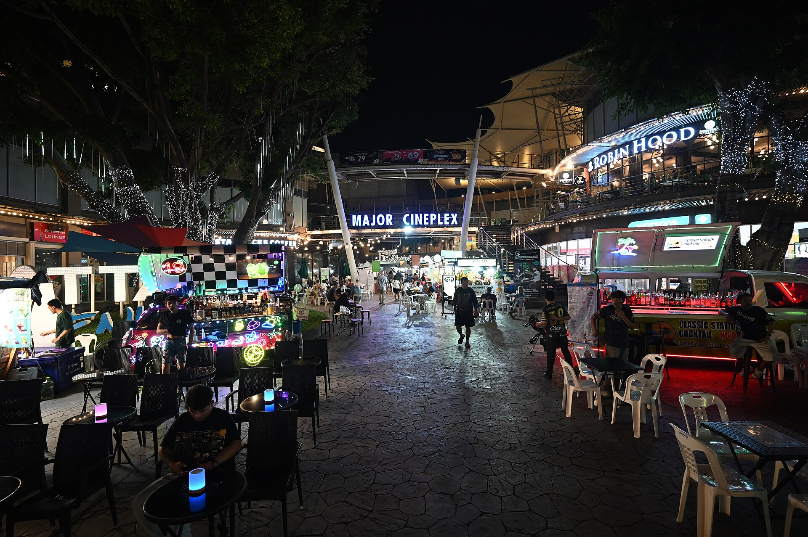

האם ישבתם לאחרונה בבית קולנוע שלוש שעות תמימות בלי לזוז? אם כן, אתם חלק ממגמה שהולכת ומתעצמת: עידן ה**סרטים הארוכים**. בשנים האחרונות נדמה שהקולנוע הגדול ויתר על הקיצור לטובת ההתמתחות — סרטים רבים חוצים את רף השעתיים וחצי, ולא מעט מהם נוגעים בשלוש שעות ואף יותר. והמפתיע מכול: הקהל, גם בישראל, ממשיך למלא את האולמות.

## מה באמת קורה לזמן הריצה בקולנוע?

התשובה הקצרה: הסרטים מתארכים, במיוחד בקטגוריית היוקרה שמכוונת לעונת הפרסים. אם פעם סרט דרמה סטנדרטי נע סביב השעתיים, הרי שהיום הפקות דגל רבות נפתחות בגאווה עם זמן ריצה של שעתיים ושלושת רבעי ומעלה. זה כבר לא פשרה טכנית אלא הצהרת כוונות — האורך הפך לחלק מהשפה האמנותית.

הדוגמאות הבולטות מדברות בעד עצמן. 'אופנהיימר' של כריסטופר נולאן (Christopher Nolan) רץ כשלוש שעות ובכל זאת הפך ללהיט קופתי עולמי. 'רוצחי הירח המלא' של מרטין סקורסזה נמתח מעבר לשלוש וחצי שעות. גם במאים כמו מרטין מקדונה, גרטה גרוויג וקוונטין טרנטינו אינם ממהרים לסיים. התחושה היא שהבמאים הגדולים כבר לא מתנצלים על האורך — הם מתהדרים בו.

## למה דווקא עכשיו? הקרב על חוויית האולם

כדי להבין את המגמה צריך להביט מעבר לבד. בעידן שבו רובנו צורכים תוכן בפיסות קטנות — קטע של דקה בטיקטוק, פרק באמצע כביסה, סרט שמושהה חמש פעמים — האורך הפך לנשק. סרט תלת-שעתי באולם חשוך הוא בדיוק ההפך מצפייה מקוטעת בסלון. הוא דורש מחויבות, נוכחות, כניעה מוחלטת לקצב של היוצר.

במאים כמו נולאן, שמטיפים לקדושת חוויית הצפייה הקולנועית, רואים באורך דרך להבדיל את הקולנוע משירותי הסטרימינג. ככל שהצפייה הביתית הופכת לזמינה וזולה, כך גדל הצורך להציע באולם משהו שלא ניתן לשחזר על הספה — אירוע, טקס, ריכוז ממושך. הסרט הארוך הוא מעין הצהרה: זאת לא עוד תוכנה שתנגנו ברקע.

### והפרדוקס של הסטרימינג

דווקא פלטפורמות כמו נטפליקס, שאפשר היה לצפות שידחפו לסרטים קצרים וקליטים, תרמו למגמה ההפוכה. כשהבמאי יודע שהסרט ייצפה גם בבית ללא לחץ של לוח הקרנות, נעלם האילוץ המסחרי לקצר. סקורסזה, למשל, נהנה מחופש יצירתי נדיר דווקא בזכות מימון מבית הסטרימינג — וחופש כזה מתורגם לרוב לעוד דקות על המסך.

## הסרטים שהאריכו את הדיון

כדי להמחיש עד כמה המספרים טיפסו, הנה מבט על כמה מהסרטים שהפכו את זמן הריצה הארוך למותג:

| סרט | במאי | זמן ריצה משוער |
|------|-------|----------------|
| אופנהיימר | כריסטופר נולאן | כ-3 שעות |
| רוצחי הירח המלא | מרטין סקורסזה | כ-3.5 שעות |
| בבילון | דמיאן שאזל | כ-3 שעות |
| הזמן שנותר | מרטין מקדונה | כ-2 שעות |
| ברבי | גרטה גרוויג | כ-2 שעות |

*(משכי הזמן מעוגלים ומובאים להמחשה.)*

## מה זה אומר על חוויית הצופה הישראלי?

בישראל המגמה מורגשת היטב. בסינמטקים בתל אביב, בירושלים ובחיפה, הקרנות של סרטי אמנות ארוכים זוכות לעיתים קרובות לאולמות מלאים ולקהל נאמן שמוכן להשקיע ערב שלם. דווקא הצופה המתוחכם, זה שבא לחפש חוויה ולא רק בידור, מריע לאורך — הוא מפרש אותו כעומק ולא כהתמשכות.

מנגד, לא הכול ורוד. בעלי אולמות מסחריים מתמודדים עם אתגר לוגיסטי אמיתי: סרט של שלוש שעות פירושו פחות הקרנות ביום, פחות מכירות כרטיסים ופחות פופקורן. יש גם שאלה פיזית פשוטה — כמה זמן קהל מסוגל לשבת בלי הפסקה, מבלי שהשלפוחית תנצח את המתח הדרמטי.

## אורך הוא לא איכות — ולהפך

הסכנה הגדולה במגמה היא ההנחה השגויה שסרט ארוך הוא בהכרח סרט עמוק. אורך אינו ערובה למשמעות; לעיתים הוא פשוט היעדר עריכה אמיצה. הקולנוע הקלאסי ידע להעביר עולם שלם בתשעים דקות הדוקות, ולא מעט יצירות מופת מוכיחות שתמצות הוא אמנות בפני עצמה.

האתגר האמיתי של היוצרים כיום הוא להצדיק כל דקה. כשסרט מתמתח ללא הצדקה, הצופה חש זאת מיד. אבל כשהאורך משרת את הסיפור — כשהוא בונה עולם, מעמיק דמויות ומאפשר לזמן לעבוד — התוצאה יכולה להיות חוויה קולנועית בלתי נשכחת. בסופו של דבר, השאלה אינה כמה ארוך הסרט, אלא האם רצינו שהוא ייגמר בכלל.
