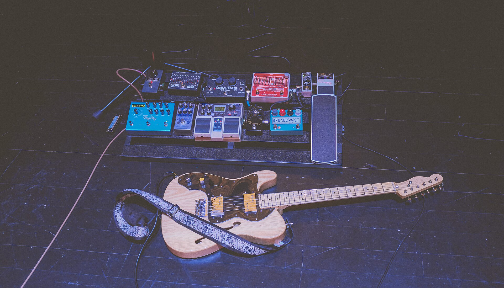

יש צלילים שלא באמת מתים, הם רק ממתינים לדור שיגלה אותם מחדש. **שואוגייז** — הז'אנר המעורפל, הרועש והחולמני שנולד בבריטניה בשלהי שנות ה-80 — חוזר בשנים האחרונות אל קדמת הבמה, והפעם דרך אוזניות של בני עשרה שלא היו בכלל בעולם כשהתקליטים המקוריים יצאו. התשובה הקצרה לשאלה 'למה דווקא עכשיו' פשוטה: טיקטוק, נוסטלגיה אנלוגית וגעגוע לצליל שעוטף במקום לצעוק.

## מה זה בכלל שואוגייז?

השם 'שואוגייז' (shoegaze, מילולית: 'מביט בנעליים') נטבע בלגלוג על נגני הלהקות שעמדו על הבמה חסרי תנועה, מרוכזים בשטיח דוושות האפקטים שלרגליהם. אבל מה שנשמע כמו עלבון הפך לחותמת של כבוד. **שואוגייז** בנוי על עקרון אחד מהפנט: קיר של גיטרות מעוותות ורוויות הֵד, שמעליו צפה שירה רכה וכמעט בלתי מובנת. המילים נבלעות בתוך הצליל, והתוצאה היא חוויה שהיא יותר תחושה מאשר שיר.

את ספר החוקים כתבה להקת **מיי בלאדי ואלנטיין** (My Bloody Valentine) עם האלבום המיתולוגי 'Loveless' מ-1991 — יצירה שנחשבת עד היום לאחת מפסגות הז'אנר. לצידה פעלו **סלואודייב** (Slowdive), **רייד** (Ride) ו**קוקטו טווינס** (Cocteau Twins), שהעניקו לז'אנר את איכותו החלומית, האתרית, כמעט הכנסייתית.

## למה שואוגייז חוזר דווקא עכשיו?

החזרה אינה מקרית. דור הזד, שגדל על מוזיקה ממוחשבת ומלוטשת, מגלה קסם מחודש בצליל האנלוגי, הלא-מושלם והעוטף. בשנים האחרונות סרטוני טיקטוק רבים אימצו קטעי שואoגייz קלאסיים כפסקול לרגעים מלנכוליים וחלומיים, והאלגוריתם עשה את השאר. פתאום שיר בן שלושים שנה חוזר למצעדי הסטרימינג.

במקביל צמח גל חדש של יוצרים צעירים שמפרשים מחדש את הז'אנר. אמנים כמו **ויספ** (Wisp) ו**ג'ولي** (Julie) זכו לחשיפה עצומה ברשתות, ומוכיחים שהצליל הזה מדבר אל הנפש גם בעידן הדיגיטלי. זהו עימות מרתק: הז'אנר הכי אנלוגי שיש, שחוזר לחיים דווקא בזכות הפלטפורמה הכי דיגיטלית שיש.

## מדריך מהיר: מאיפה מתחילים?

מי שרוצה לצלול פנימה יכול להתחיל מכמה אבני דרך מרכזיות של הז'אנר:

| אלבום / אמן | שנה | למה חובה |
|---|---|---|
| מיי בלאדי ואלנטיין — Loveless | 1991 | ספר הבראשית של הז'אנר |
| סלואודייב — Souvlaki | 1993 | הצד הרגשי והמלודי |
| רייד — Nowhere | 1990 | אנרגיה ועוצמה גיטרית |
| קוקטו טווינס — Heaven or Las Vegas | 1990 | האיכות האתרית החלומית |
| ויספ / ג'ולי | שנות ה-2020 | הגל החדש של הדור הצעיר |

## ומה קורה בישראל?

גם בישראל הגל מורגש. הצליל של **שואוגייז** מעולם לא היה מסחרי כאן, אבל בשנים האחרונות ניכרת התעוררות: פלייליסטים ייעודיים צוברים מאזינים, להקות אינדי מקומיות מאמצות קירות גיטרות ועיוותים, ומופעים אינטימיים במועדונים קטנים בתל אביב מושכים קהל צעיר שמחפש חוויה סוחפת אחרת.

זה משתלב במגמה רחבה יותר של חזרה אל האנלוגי — מהוויניל ועד הקלטות על סליל — ושל חיפוש אחר אותנטיות בתוך ים של הפקות מלוטשות. שואוגייz מציע בדיוק את זה: מוזיקה שמזמינה אותך לא רק להקשיב, אלא להתמוסס פנימה.

## האם זה כאן כדי להישאר?

טרנדים מוזיקליים נוטים להגיע בגלים, אבל שואוגייz שונה. הוא מעולם לא נעלם לגמרי — הוא פשוט המתין בשוליים, השפיע על ז'אנרים כמו דרים-פופ ושילוב'גייז, וחיכה לרגע הנכון. העובדה שדור שלם מגלה אותו עכשיו מאפס, מבלי להכיר את ההקשר ההיסטורי, דווקא מעידה על חוזקו: זהו צליל שמדבר אל רגש אוניברסלי, מעבר לאופנה. אם תשמעו באחרונה גיטרה מעוותת שעוטפת אתכם כמו ערפל — אתם כבר בפנים.
