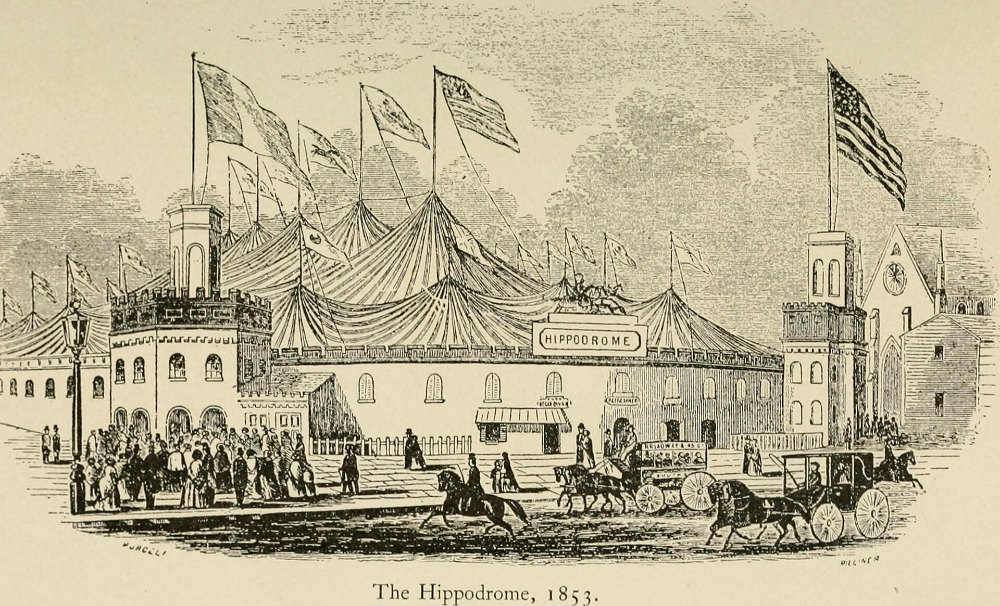

## מה זה תיאטרון אימרסיבי ולמה כולם מדברים עליו?

תיאטרון אימרסיבי הוא צורת מופע שבה הקהל מפסיק להיות צופה פסיבי וְהופך לחלק מהחוויה: הוא קם מהכיסא, נע בין חללים, בוחר אחרי איזו דמות ללכת, ולעיתים אף נוגע, מריח וטועם את העולם הבדיוני. במקום במה אחת מוארת מול שורות כיסאות בחושך, מדובר בבניין שלם, במחסן, בבית נטוש או בחדר מלון שהופכים לזירת עלילה. זו בדיוק הסיבה שהז'אנר הזה מסעיר כל כך את עולם התיאטרון — הוא מפרק את החוזה הישן בין השחקן לצופה ומנסח אותו מחדש.

התשובה הקצרה לשאלה "למה עכשיו": בעידן שבו מסכים מציעים לנו הכול בלחיצת כפתור, התיאטרון מחפש את מה שאי אפשר לשכפל — נוכחות פיזית, בלתי אמצעית ובלתי חוזרת. תיאטרון אימרסיבי הוא התשובה הרדיקלית ביותר של הבמה למשבר הקשב.

## מאיפה זה הגיע? קצת היסטוריה

השורשים נטועים בתיאטרון האוונגרד של המאה ה-20 — מהמופעים הטקסיים של יז'י גרוטובסקי ועד ה"האפנינגס" של שנות השישים, שבהם אמנים טשטשו את הגבול בין אמנות לחיים. אבל הפריצה הגדולה לתודעה הרחבה הגיעה עם להקת פאנצ'דרנק (Punchdrunk) הבריטית, שהפכה את ההפקה "Sleep No More" — עיבוד חופשי ל"מקבת" של שייקספיר בנוסח סרטי אימה של היצ'קוק — לתופעה בינלאומית. הקהל, חבוש מסכות לבנות, משוטט בחופשיות בין קומות של מלון פיקטיבי, ורודף אחרי סצנות שמתרחשות בו-זמנית בחדרים שונים.

מאז, הגישה חלחלה לפסטיבלים, למוזיאונים וגם לעולם המותגים והחוויות המסחריות. חברות כמו "סיקרט סינמה" (Secret Cinema) הפכו הקרנת סרט לאירוע עולמי שלם, והמודל האימרסיבי הפך לשפה תרבותית בפני עצמה.

## איך זה מרגיש מבפנים?

החוויה האימרסיבית בנויה על עיקרון אחד מכונן: **אתה לא רואה את הכול**. בניגוד להצגה רגילה שבה כולם רואים את אותה תמונה, כאן כל צופה גוזר לעצמו מסלול אישי. אחד יעקוב אחרי הגיבורה הראשית, אחר יישאר בחדר ריק ויגלה מכתב נסתר במגירה, ושלישי יימשך אל ריקוד אלים במרתף. אין שתי הצגות זהות, ואין "נוסח נכון".

זה גם מקור הכוח וגם מקור התסכול. התחושה של גילוי אישי, של סוד שרק אתה חשפת, היא ממכרת. מצד שני, יש הנאלצים להתמודד עם "פחד ההחמצה" — הידיעה שברגע זה ממש מתרחשת סצנה מכרעת בקומה אחרת.

## תיאטרון אימרסיבי בישראל

בישראל הז'אנר עדיין בשלבי התבססות, אך הסימנים ברורים. פסטיבל עכו לתיאטרון אחר היה שנים ערש לעבודות סייט-ספסיפיק שמוציאות את הצופה אל מבצר, אל סמטה או אל חלל לא שגרתי. גם בתל אביב ובירושלים צצות הפקות עצמאיות שמזמינות את הקהל להסתובב, לבחור ולהשתתף, ומופעי "חדר בריחה" תיאטרליים משכללים את הגבול בין משחק לעלילה.

גם מוסדות הממסד מגששים לכיוון: ערבי מופע מיוחדים, סיורים מבוימים והצגות שמתרחשות מחוץ לאולם הקלאסי. הקהל הישראלי, שגדל על תרבות של השתתפות ישירות וחוסר פורמליות, הוא קרקע פורייה במיוחד לגישה הזו.

## טבלה: סוגי תיאטרון אימרסיבי ומה מצפה לכם

| סוג החוויה | מאפיין מרכזי | רמת מעורבות הצופה |
|---|---|---|
| מופע נדודים (כמו Sleep No More) | חלל גדול, סצנות מקבילות | גבוהה — בוחרים מסלול |
| סייט-ספסיפיק | מתרחש באתר אמיתי ולא בתיאטרון | בינונית — נעים במרחב |
| תיאטרון חדר / חדר בריחה תיאטרלי | קבוצה קטנה, חידות ועלילה | גבוהה מאוד — פותרים ופועלים |
| מופע אינטראקטיבי באולם | הקהל יושב אך משפיע על הנעשה | נמוכה-בינונית |

## האתגרים שמסתתרים מאחורי הקסם

הצד הבוהק של הז'אנר מלווה בשאלות לא פשוטות. ההפקות הללו יקרות — דורשות חללים גדולים, צוותי שחקנים רבים וקהל קטן יחסית בכל מופע, מה שמקשה על כלכליות. יש גם סוגיות של **בטיחות** ושל **גבולות אתיים**: עד כמה מותר לשחקן לגעת בצופה? מה קורה כשמשתתף חוצה קו? הפקות רציניות משקיעות היום בפרוטוקולים ברורים ובמנגנוני הגנה על הקהל.

ויש גם ביקורת אמנותית: לא פעם נטען שהחוויה מרשימה יותר מהתוכן, שהאפקט גובר על המשמעות. תיאטרון אימרסיבי טוב הוא זה שבו ההשתתפות אינה גימיק אלא דרך לומר משהו שאי אפשר לומר אחרת.

## האם זה העתיד של התיאטרון?

סביר יותר שזו הרחבה מרתקת מאשר החלפה. התיאטרון הקלאסי, עם הבמה, הטקסט והישיבה בחושך, לא ייעלם. אבל תיאטרון אימרסיבי מזכיר לנו דבר יסודי: התיאטרון נולד כאירוע חי, משותף ובלתי צפוי. ככל שהעולם הופך וירטואלי יותר, דווקא ההזמנה לקום, להיכנס פנימה ולהיות חלק מהסיפור — נשמעת רלוונטית מתמיד.
