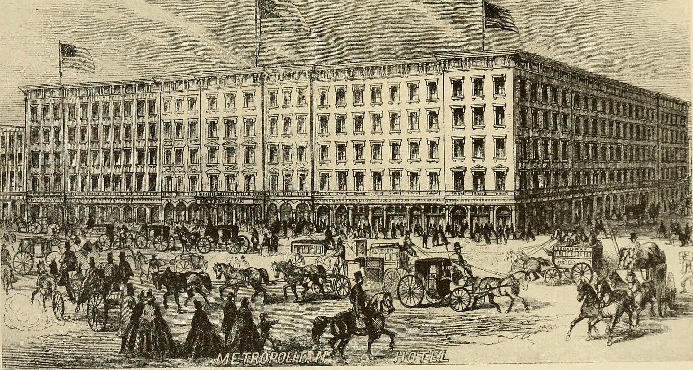

מה קורה כשהקהל כבר לא יושב בחושך אלא פוסע בין השחקנים, פותח מגירות, רודף אחרי דמות במסדרון אפל? זהו **תיאטרון אימרסיבי** — ז'אנר שמפרק את הקיר הרביעי ומזמין את הצופה להיות חלק מהיצירה ולא עד חיצוני לה. במקום מושב ממוספר ומסך שמפריד, אתם מקבלים חופש תנועה, מסכה על הפנים ולעיתים אפילו תפקיד קטן בעלילה.

המגמה הזו, שצברה תאוצה בעשור האחרון, משנה את עצם ההגדרה של מהי הצגה. היא ממירה את הצפייה הפסיבית בחוויה גופנית, חושית ואישית — וכל זה הופך אותה לאחד הכיוונים המסקרנים ביותר על הבמה העכשווית, בעולם וגם בישראל.

## מה זה בעצם תיאטרון אימרסיבי?

המילה אימרסיבי (immersive) פירושה "טובלני" או "עוטף". בתיאטרון אימרסיבי הצופה נמצא פיזית בתוך החלל שבו מתרחשת העלילה, לרוב ללא כיסאות ובלי כיוון צפייה אחד נכון. אתם רשאים לנוע, לבחור אחרי איזו דמות ללכת, ולהרכיב בעצמכם את סדר הסצנות שאתם רואים.

התוצאה היא שאין שתי חוויות זהות. שני אנשים שהגיעו לאותה הצגה עשויים לצאת עם שני סיפורים שונים לגמרי, תלוי בנתיב שבחרו ובמקרה שהוביל אותם לחדר כזה ולא אחר. זהו תיאטרון שמהמר על סקרנות, על ההחלטה הרגעית ועל תחושת ההרפתקה.

## מאיפה הגיעה המגמה?

השורשים נטועים בתיאטרון הסביבתי ובמופעי המחול־תיאטרון של המאה העשרים, אך הפריצה הגדולה לתודעה הרחבה הגיעה מהפקות בינלאומיות שהפכו לתופעה. המזוהה מכולן היא **'Sleep No More'** של להקת פאנצ'דראנק (Punchdrunk) הבריטית — עיבוד חופשי ל"מקבת" של שייקספיר, שהתרחש במבנה ענק דמוי מלון, ובו הקהל נדד בין קומות עם מסכות לבנות על הפנים.

ההצלחה הזו פתחה דלת למגל רחב של יוצרים ברחבי העולם, מלונדון וניו יורק ועד פסטיבלים באירופה, שהחלו לחפש חללים לא שגרתיים: מחסנים נטושים, בתי מלון, מרתפים, רחובות ומוזיאונים. העיקרון המשותף — להוציא את התיאטרון מהקופסה השחורה המסורתית.

## למה דווקא עכשיו הקהל רוצה להיכנס פנימה?

בעידן של מסכים, סטרימינג וצפייה אינסופית מהספה, יש צמא גובר לחוויה שאי אפשר לשכפל או להשהות. תיאטרון אימרסיבי מציע בדיוק את זה: נוכחות פיזית, חד־פעמיות ומפגש אנושי בלתי אמצעי.

- **אינטימיות**: המרחק בין השחקן לצופה מצטמצם לסנטימטרים.
- **בחירה**: הצופה שותף פעיל שמכתיב את מסלולו.
- **חד־פעמיות**: כל ערב שונה, וזה מה שהופך את הכרטיס לבלתי ניתן לשחזור.
- **רב־חושיות**: ריחות, מרקמים, מוזיקה חיה ומגע הופכים לחלק מהדרמה.

## תיאטרון אימרסיבי בישראל

גם בישראל הז'אנר מכה שורשים, גם אם תחת שמות שונים — תיאטרון סביבתי, מופעי מסע או הצגות בחלל ספציפי. **פסטיבל עכו לתיאטרון אחר** היה שנים רבות חממה טבעית לסוג כזה של עבודות, שבהן הקהל נע בין מבצרים, מרתפים וחצרות העיר העתיקה. גם הסינמטקים, הגלריות ומרכזי אמנות עצמאיים מארחים מדי פעם יצירות שמטשטשות את הגבול בין קהל למופע.

יוצרים צעירים בתל אביב ובירושלים מנסים את גבולות הצורה: הצגות בדירות פרטיות, מופעים בבתי קפה, ומסעות הליכה מודרכים שמשלבים טקסט, שחקנים ומרחב עירוני. זהו שדה שעדיין בהתהוות, אך הסקרנות סביבו רק הולכת וגדלה.

## טבלה: סוגי החוויה האימרסיבית

| סוג החוויה | מאפיין מרכזי | מידת מעורבות הצופה |
| --- | --- | --- |
| תיאטרון נדודים | הקהל נע בין חדרים וחללים | גבוהה — בוחר מסלול |
| מופע מסע עירוני | הליכה מודרכת במרחב אמיתי | בינונית־גבוהה |
| הצגה בחלל אינטימי | דירה, מרתף או בית קפה | בינונית |
| חוויה אינטראקטיבית | הצופה משפיע על העלילה | גבוהה מאוד |

## האם זה באמת תיאטרון?

יש מי שתוהה אם כשהקהל משוטט חופשי מדובר עדיין בתיאטרון, או כבר במשחק תפקידים או אטרקציה חווייתית. אבל דווקא השאלה הזו היא חלק מהקסם: הז'אנר מאתגר את ההגדרות המקובלות ומכריח אותנו לחשוב מחדש על מהות המפגש התיאטרלי. בסופו של דבר, גם כאן יש טקסט, דמויות, דרמטורגיה ובמאי — פשוט בלי כורסה שתפריד ביניכם.

המלצה למתלבטים: היכנסו בלב פתוח ובלי לדאוג ל"לעשות את זה נכון". אין מסלול אחד נכון, וזו בדיוק הנקודה. תנו לעצמכם לטבול פנימה.
