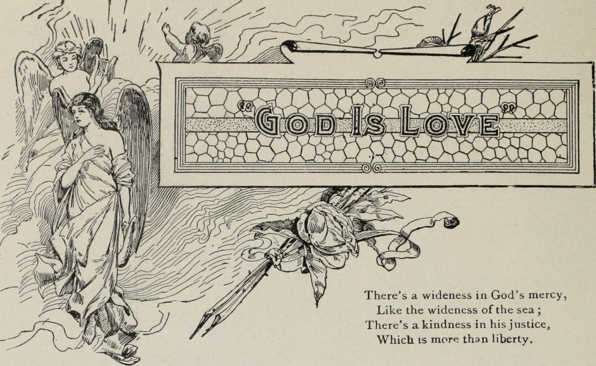

אם נכנסתם לאחרונה לחנות ספרים וראיתם מדף שלם עטוף בכריכות של דרקונים, כנפיים וזוגות שנועצים מבטים לוהטים — פגשתם את רומנטזי, הז'אנר הספרותי החם ביותר של התקופה. בקצרה: **רומנטזי (Romantasy) הוא מיזוג בין רומן רומנטי לפנטזיה**, שבו סיפור האהבה וסיפור העולם הקסום מקבלים משקל שווה. זו אינה פנטזיה עם טיפת רומנטיקה ולא רומן עם קישוט קסום — אלא ז'אנר שלם שהפך בשנים האחרונות למנוע הצמיחה המרכזי של שוק רבי המכר.

## מה זה בעצם רומנטזי?

בלב הז'אנר עומדת הבטחה כפולה: עולם שלם ובנוי לעומק — עם מערכות קסם, ממלכות, יצורים מיתולוגיים ומלחמות — לצד קו עלילה רומנטי מתוח שמחזיק את הקורא עד הדף האחרון. בניגוד לפנטזיה הקלאסית, שבה האהבה היא לכל היותר עלילת משנה, ברומנטזי היא העמוד השדרה.

הגיבורות הן כמעט תמיד נשים צעירות, חזקות ומורכבות, שעוברות מסע התבגרות והעצמה. לצידן ניצב בן זוג — לא פעם מסוג ה"רע-טוב" המסתורי — והמתח ביניהם נבנה לאט, בטכניקות ספרותיות שהקהל מכיר ואוהב: שנאה שהופכת לאהבה, גורל כפוי, או ברית אסורה בין יריבים.

## למה דווקא עכשיו הז'אנר מתפוצץ?

ההצלחה של רומנטזי אינה מקרית. היא נשענת על כמה כוחות שפועלים יחד.

- **קהילת קוראים דיגיטלית:** המלצות הדדיות ברשתות החברתית הפכו ספרים אלמוניים לתופעות בין-לאומיות כמעט בן לילה.
- **בריחה מהמציאות:** בעולם עמוס חדשות קשות, הקוראים מחפשים מפלט אל ממלכות קסומות עם סוף טוב מובטח.
- **העצמה נשית:** הגיבורות אינן נסיכות מצילות — הן לוחמות, מנהיגות ובעלות קול, מה שמהדהד לקהל צעיר.
- **כתיבה ממכרת:** מבנה עלילתי שנבנה סביב מתח רגשי וקליף-האנגרים גורם לקוראים "לבלוע" ספר אחרי ספר.

השילוב הזה יצר נאמנות יוצאת דופן: קוראות רבות לא מסתפקות בספר בודד אלא צורכות סדרות שלמות, ומחכות בכיליון עיניים לכרך הבא.

## מי הסופרות שהציתו את הגל?

אי אפשר לדבר על רומנטזי בלי להזכיר את **שרה ג'יי מאאס (Sarah J. Maas)**, שסדרותיה — ובראשן "חצר של קוצים וורדים" — נחשבות לאבן יסוד של הז'אנר ומכרו עשרות מיליוני עותקים ברחבי העולם. לצידה בלטה **רבקה יארוס (Rebecca Yarros)**, שספרה "כנף רביעית" על אקדמיה לרוכבי דרקונים הפך לאחת מתופעות ההוצאה לאור הגדולות, והקפיץ את כל הז'אנר לקדמת הבמה.

סופרות נוספות כמו **ג'ניפר ל. ארמנטראוט** ו**לי ברדוגו** הרחיבו את גבולות הז'אנר, כל אחת בטעם משלה — מהעלילות הלוהטות ועד לבנייני העולם המורכבים. התוצאה היא מרחב ספרותי מגוון שמציע כניסה נוחה לקוראים חדשים לצד עומק לוותיקים.

## טבלה: נקודות כניסה מומלצות לז'אנר

| הספר / הסדרה | הסופרת | למי זה מתאים |
|---|---|---|
| חצר של קוצים וורדים | שרה ג'יי מאאס | מחפשים רומנטיקה עוצמתית ועולם עשיר |
| כנף רביעית | רבקה יארוס | אוהבי אקשן, דרקונים ומתח מתוח |
| צל ועצם | לי ברדוגו | מעדיפים בניית עולם קולנועית |
| מרגת הדם וחורבן | ג'ניפר ל. ארמנטראוט | מכורים לקצב מהיר ולקליף-האנגרים |

## איך זה נראה בישראל?

גם המדף הישראלי הרגיש את הרעש. הוצאות הספרים זיהו את הביקוש הגובר, ובשנים האחרונות ניכר גל של תרגומים לכותרים המובילים של הז'אנר, לצד מהדורות מיוחדות עם קצוות דפים צבועים שהפכו לחפצי אספנות. חנויות הספרים הגדולות הקצו מדפים ייעודיים, ומועדוני קריאה — פיזיים ומקוונים — צמחו סביב הכותרים הפופולריים.

הקהל הישראלי, בעיקר קוראות בשנות העשרים והשלושים לחייהן, מצא ברומנטזי שילוב מנצח: ספרות מהנה שאינה מתנצלת על היותה בידורית, אך גם אינה חוסכת בעומק רגשי ובדיון על כוח, מגדר ובחירה.

### ביקורת: לא הכל ורוד

כמו כל תופעה מסחרית, גם רומנטזי סופג ביקורת. יש הטוענים שהנוסחה חוזרת על עצמה, שהדמויות לעיתים שטוחות ושבניית העולם משרתת בעיקר את הרומנטיקה. אחרים מצביעים על תכנים לבוגרים שלא תמיד מסומנים כראוי לקהל הצעיר. ובכל זאת — קשה להתווכח עם מספרים: הז'אנר מחזיר קוראים רבים אל הקריאה, ובעידן של מסכים ותחרות על תשומת הלב, זו בשורה בפני עצמה.

## בשורה התחתונה

רומנטזי אינו אופנה חולפת אלא מגמה שעיצבה מחדש את מפת רבי המכר. הוא מצליח במקום שבו ז'אנרים רבים מתקשים — לגרום לאנשים לקרוא יותר, להתלהב ולדבר על ספרים. בין אם אתם מעריצים מושבעים ובין אם סקרנים מהצד, שווה לבקר במדף הדרקונים הקרוב — ולגלות מדוע עולם שלם מתאהב מחדש בקריאה.
