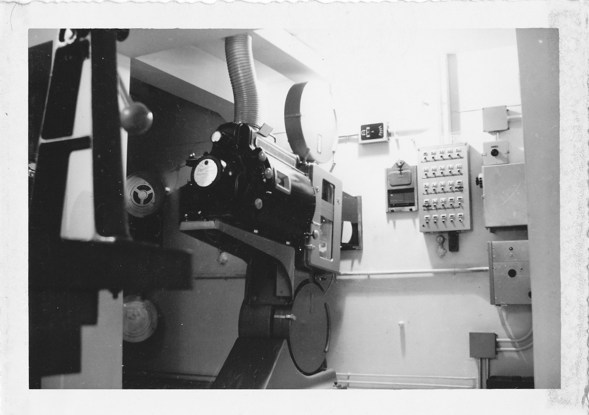

בזמן שהעולם כולו עבר לדיגיטל חלק, נוח וזול, קבוצה הולכת וגדלה של במאים מהשורה הראשונה עושה בדיוק ההפך: חוזרת אל סלילי הצלולואיד הכבדים. **הצילום על פילם**, שנדמה היה כמי שנדון להכחדה, הפך בשנים האחרונות לסמל סטטוס אמנותי — דרך להכריז שהסרט הזה הוא יצירה, לא רק עוד קובץ וידאו. התשובה הקצרה לשאלה 'למה': מרקם, יוקרה, ותחושת אירוע שהמסך הדיגיטלי מתקשה לשחזר.

## למה הצילום על פילם חזר לאופנה?

משך כמעט שני עשורים נראה שהדיגיטל ניצח בנוקאאוט. מצלמות קלות, אחסון זול, אפשרות לצלם שעות בלי להחליף סליל — כל אלה כבשו את התעשייה. אבל דווקא כשהכל הפך זמין וזהה, נולד הצורך להתבדל. **הצילום על פילם** הפך לאמירה: סרט שצולם על צלולואיד מכריז על עצמו כמוצר יוקרה, שנעשה בכוונת מכוון ובמחיר גבוה.

הגרעיניות העדינה, האופן שבו הפילם 'שובר' אור חזק, עומק הצבעים והדרך שבה הוא מטפל בגווני עור — כל אלה יוצרים מרקם אורגני שצופים רבים מזהים כ'קולנועי' גם בלי לדעת להסביר מדוע. בעידן שבו בינה מלאכותית וגרפיקה ממוחשבת מציפות את המסך, יש משהו מרגיע באמת שאנלוגית, מוחשית, שנחרטה פיזית על חומר.

## מי הם השגרירים של הצלולואיד?

אי אפשר לדבר על המגמה בלי להזכיר את **כריסטופר נולאן** (Christopher Nolan), שהפך למעין כוהן גדול של הפורמט. סרטים כמו 'דנקרק' ו'אופנהיימר' צולמו על פילם בפורמטים ענקיים, והוא דחף נמרצות להקרנות ב-70 מ"מ ובאיימקס. עבורו, המסך הגדול אינו גימיק אלא העיקר.

**קוונטין טרנטינו** (Quentin Tarantino) הוא לוחם אידיאולוגי נוסף. הוא אף שיפץ בתי קולנוע כדי שיוכלו להקרין '70 מ"מ שמונה המושמצים', והצהיר שוב ושוב על אהבתו לחוויה האנלוגית. אליהם מצטרפת **גרטה גרוויג** (Greta Gerwig), שהפתיעה רבים כשבחרה לצלם את 'ברבי' הצבעוני והפופי דווקא על פילם, כדי להעניק לו חום נוסטלגי. גם במאים כמו **פול תומאס אנדרסון** ו**ג'ורדן פיל** נמנים עם המחנה.

## 70 מ"מ, 35 מ"מ ואיימקס: מה ההבדל?

לא כל פילם נולד שווה. ככל שרצועת הפילם רחבה יותר, כך הדימוי חד, עשיר ומפורט יותר. הנה מפת ההתמצאות הבסיסית:

| פורמט | מאפיין בולט | דוגמה מוכרת |
|---|---|---|
| 35 מ"מ | התקן ההיסטורי הקלאסי, מרקם חמים | רוב קלאסיקות הקולנוע |
| 65/70 מ"מ | רזולוציה עצומה, עומק יוצא דופן | 'אופנהיימר', 'שמונה המושמצים' |
| איימקס פילם | הפורמט הגדול ביותר, חוויית ענק | סצנות מתוך 'דנקרק' |
| 16 מ"מ | גרעיני, אינדי, תחושת גלם | סרטי ארט וקולנוע ניסיוני |

ההבדל אינו טכני בלבד. סרט שצולם ב-70 מ"מ והוקרן על מסך בגובה בניין הוא אירוע — מהסוג שלא ניתן לשחזר על מסך טלוויזיה או טלפון. וזה בדיוק הקלף המרכזי של המגמה.

## האם זה רק נוסטלגיה?

קל לפטור את החזרה לצלולואיד כגחמה של במאים מבוגרים או כאובססיה של פוריסטים. אבל מתחת לפני השטח מסתתר מהלך אסטרטגי. בעידן של פלטפורמות הזרמה, כשהצופה יכול לעצור את הסרט באמצע כדי להכין קפה, הקולנוע נלחם על עצם קיומו כחוויה פיזית ייחודית.

**הצילום על פילם** הוא חלק מאותו מאבק. הוא מחייב ריכוז, הכנה, הקרנה מקצועית, ולעיתים נסיעה מיוחדת לבית קולנוע שמצויד למשימה. במובן זה, המגמה אינה רק על אסתטיקה — היא הצהרה על ערך הטקס הקולנועי.

### ומה עם ישראל?

גם בישראל גובר העניין. הסינמטקים בתל אביב ובירושלים מקיימים מדי פעם הקרנות של עותקי פילם נדירים, ומושכים קהל שמוכן לשלם על חוויה שמרגישה היסטורית ואותנטית. עבור צופים שגדלו על דיגיטל, זו לעיתים הפעם הראשונה שהם רואים כיצד נראה סרט 'כפי שהתכוונו היוצרים'.

## הצד השני של המטבע

חשוב לא להתרומם יתר על המידה. הצילום על פילם יקר משמעותית, דורש מומחיות הולכת ונעלמת, ופחות סלחני בצילומים. חברות רבות כבר אינן מייצרות פילם, ומספר המעבדות שיכולות לפתח אותו הצטמצם דרמטית. יש הטוענים שמדובר בפריבילגיה של במאים בעלי שם, בעלי תקציב וכוח, בעוד יוצרים צעירים נשארים עם הדיגיטל.

ובכל זאת, יש בעצם קיומה של המגמה בשורה: היא מזכירה שהקולנוע הוא לא רק תוכן, אלא אמנות שיש לה גוף, מרקם וחומר. וכל עוד במאים גדולים ממשיכים להילחם על הצלולואיד, נראה שהסרט הפיזי רחוק מלומר את מילתו האחרונה.
