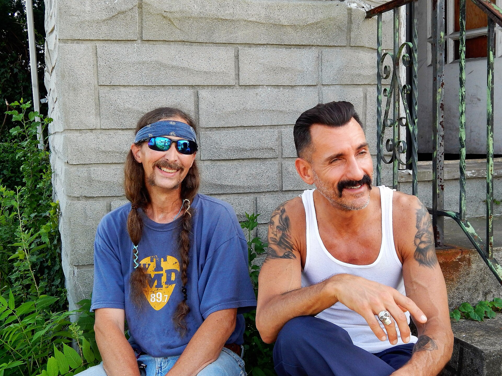

יש רגע מסוים בצפייה בסרט שבו הקיבה מתהפכת — כשמטוס אמיתי מתרסק, כשמכונית באמת עפה באוויר, כשהאש שאוחזת בגיבור נראית חמה מדי. הרגע הזה, שנדמה כי אבד בעידן המסכים הירוקים, חוזר אל הקולנוע בכוח. **האפקטים המעשיים** — אותם פעלולים, פיצוצים ותפאורות ענק שמצולמים באמת מול המצלמה — הפכו בשנים האחרונות לסמל של יוקרה אמנותית, ובמאים מהשורה הראשונה מתחרים זה בזה מי יצלם את הדבר האמיתי.

## מה הם בכלל אפקטים מעשיים?

בניגוד לאפקטים הממוחשבים (סי-ג'י-איי), שנוצרים כולם במחשב לאחר הצילומים, **אפקטים מעשיים** מתרחשים לנגד עיני הצוות: דגמים פיזיים, מכונאות, פירוטכניקה, איפור תותבות ופעלולים אנושיים. זו שיטת העבודה שבנתה את הקולנוע מראשיתו — מהמפלצות של ריי הריהאוזן ועד הפיצוצים של סרטי האקשן בשנות השמונים — ולפתע היא שוב חזית הטרנד.

ההסבר פשוט: הקהל, גם אם אינו מודע לכך, מזהה את ההבדל. יש משקל, אור וצל, אבק ועשן שהמחשב עדיין מתקשה לזייף במדויק. התחושה הקרבית הזו היא בדיוק מה שהקולנוע מחפש כדי להחזיר אנשים אל האולם הגדול.

## מי מוביל את המהפכה?

השם הראשון שעולה הוא כמובן **כריסטופר נולאן**. הבמאי, שמסרב כמעט עקרונית לעבוד עם מסך ירוק, פוצץ מטוס בואינג אמיתי ב"תחילה" ("טנט"), בנה סטים מסתובבים ב"התחלה" ("אינספשן"), וב"אופנהיימר" אף התעקש לדמות את פיצוץ הניסוי הגרעיני בעזרת אפקטים פיזיים בלבד, בלי פיצוץ ממוחשב אחד.

לצידו ניצבים ענקים נוספים:

- **ג'ורג' מילר**, שב"מקס הזועם: כביש הזעם" שלח עשרות רכבים אמיתיים להתנגש במדבר נמיביה, במה שנחשב לאחד ממופעי הפעלולים המרשימים בתולדות הז'אנר.
- **דני וילנב**, שבשני חלקי "חולית" ("דיון") בנה תפאורות ענק ומדבריות אמיתיים, וצמצם את הדיגיטל לרקעים ולטקסטורות בלבד.
- **טום קרוז** ו"משימה בלתי אפשרית", שהפכו את הפעלול האנושי המסוכן לחתימה מסחרית — מטיפוס על מטוס ממריא ועד קפיצה ממצוק באופנוע.

## למה דווקא עכשיו?

דווקא כשהטכנולוגיה הדיגיטלית מגיעה לשיא יכולתה, מתחזקת הנהייה אל האמיתי. מדוע? ראשית, עייפות הקהל. אחרי עשור של סרטי גיבורי-על עמוסים בפיקסלים, רבים מרגישים שהדימוי הממוחשב איבד ממשקלו הרגשי. כשהכול אפשרי, שום דבר לא מסוכן — ובלי סכנה אין מתח.

שנית, יוקרה. אפקט מעשי משדר מחויבות אמנותית, תקציב והשקעה. הוא הפך לתו תקן של קולנוע "רציני", ומושך את תשומת לב מבקרי הקולנוע וחברי האקדמיה.

### טבלה: אפקטים מעשיים מול דיגיטליים

| היבט | אפקטים מעשיים | אפקטים דיגיטליים |
|---|---|---|
| תחושת אמינות | גבוהה מאוד | תלויה באיכות ובתקציב |
| עלות | יקר בצילום עצמו | יקר בעיבוד שלאחר הצילום |
| סיכון | ממשי לצוות ולפעלולנים | אפסי |
| גמישות | מוגבלת, דורשת תכנון מוקדם | כמעט בלתי מוגבלת |
| התיישנות | מזדקן יפה עם השנים | עלול להיראות מיושן מהר |

## האם זו נטישה של הדיגיטל?

כאן חשוב לדייק. אף אחד מהבמאים הללו אינו נוטש את המחשב לחלוטין. **אפקטים מעשיים** מודרניים כמעט תמיד משולבים עם "ניקוי" דיגיטלי — הסרת חוטי פעלולים, הרחבת רקעים, חיבור בין שכבות. המהפכה האמיתית אינה בהכחדת הדיגיטל, אלא בהיפוך סדר העדיפויות: קודם מצלמים כמה שיותר באמת, ורק אחר כך משלימים במחשב את מה שאי אפשר.

הגישה ההיברידית הזו מולידה את התוצאות המרשימות ביותר. כשהבסיס פיזי, גם התוספות הממוחשבות נראות משכנעות יותר, כי הן נשענות על אור, צל ופרספקטיבה אמיתיים.

## מה זה אומר לצופה הישראלי?

גם הקהל המקומי מרוויח מהמגמה. סרטים שמצולמים באפקטים מעשיים הם בדיוק הסוג שכדאי לראות על המסך הגדול — בסינמטק תל אביב, בפסטיבל הקולנוע בירושלים או באולם איימקס. הפירוט, המרקם והעומק הפיזי פשוט הולכים לאיבוד בצפייה ביתית בטלפון.

החזרה אל האמיתי היא בסופו של דבר תזכורת למה שהקולנוע ידע מההתחלה: שהקסם הגדול ביותר הוא דווקא הדבר שקרה באמת, אל מול המצלמה, ברגע אחד חד-פעמי שלא ניתן לחזור עליו.
